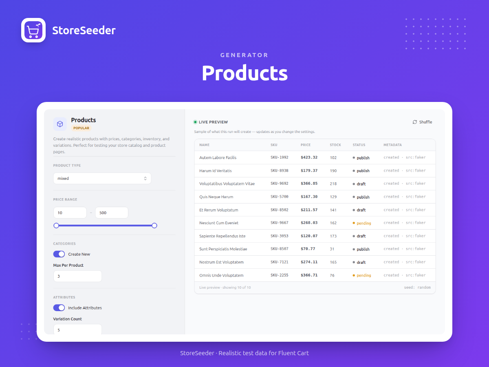

# Fluent Cart FakerPress

[](https://wordpress.org/)
[](http://www.gnu.org/licenses/gpl-2.0.txt)
[](https://php.net/)
[]()

🚀 **Generate realistic test data for your Fluent Cart store in seconds!** Create products, customers, orders, coupons and more with our intuitive admin interface. Perfect for development, testing, and demos. Features smart defaults, real-time validation, and seamless WordPress integration.

## ❓ What is Fluent Cart FakerPress?

**Fluent Cart FakerPress** helps you populate your Fluent Cart store with realistic test data quickly and easily. Whether you're:

- 🧑‍💻 **Developing** new features and need test data
- 🧪 **Testing** plugins, themes, or integrations
- 🎬 **Creating demos** for clients or presentations
- 📈 **Analyzing performance** with realistic data sets

Our plugin generates high-quality, realistic data that behaves just like real customer data, making your testing and development process much more effective.

## 🚀 Get Started in Minutes

### For Users

1. **Install & Activate**: Install the plugin from WordPress.org and activate it
2. **Open Interface**: Go to WordPress Admin → **FC FakerPress**
3. **Start Generating**: Choose a generator and click "Generate" - that's it!

### For Developers

```bash
# Install dependencies
composer install && npm install

# Build assets
npm run build

# Activate plugin
# WordPress Admin → Plugins → Activate "Fluent Cart FakerPress"
```

## ✨ Key Features

- 🛍️ **10 Smart Generators** - Create realistic products, customers, orders, coupons, and more
- 🎯 **One-Click Generation** - Smart defaults with easy customization options
- 🎨 **Beautiful Interface** - Modern design that matches your WordPress admin theme
- ⚡ **Lightning Fast** - Generate thousands of items in seconds
- 🔧 **Developer Friendly** - Extensive customization options and API access

## 📸 Screenshots

### Main Interface


_The modern, tabbed interface with WordPress admin color integration_

### Product Generator


_Advanced product generation with attributes, variations, and inventory settings_

### Customer Generator


_Comprehensive customer profile generation with demographics and loyalty tiers_

## 📚 Documentation

| Document                                      | Description                                |
| --------------------------------------------- | ------------------------------------------ |
| [📦 Installation Guide](docs/installation.md) | Setup instructions and requirements        |
| [🚀 Usage Guide](docs/usage.md)               | How to use the generators and interface    |
| [✨ Features Overview](docs/features.md)      | Complete feature list and capabilities     |
| [🏗️ Architecture](docs/architecture.md)      | Technical architecture and design patterns |
| [🛠️ Development Guide](docs/development.md)  | Contributing and development workflow      |
| [📋 Changelog](docs/changelog.md)             | Version history and release notes          |

## 📋 Requirements

- **WordPress**: 5.0+
- **PHP**: 7.4+
- **Fluent Cart Plugin**: Required
- **Node.js**: 16+ (development)
- **Composer**: For PHP dependencies

## 🛠️ Quick Commands

```bash
# Install dependencies
composer install && npm install

# Development
npm run start            # Watch mode
npm run build            # Production build

# Code quality
composer run lint        # PHP CodeSniffer
composer run analyse     # PHP Static Analysis
```

## 🏗️ Built for Reliability

- **Modern & Fast** - Built with React 18 and WordPress REST API for lightning-fast performance
- **WordPress Native** - Seamlessly integrates with your WordPress admin and Fluent Cart
- **Quality Assured** - Rigorous testing and code quality standards ensure reliability
- **Developer Ready** - Extensive customization options and comprehensive documentation

## 🤝 Contributing

Contributions welcome! See [Development Guide](docs/development.md) for complete contributing guidelines, development setup, coding standards, and workflow.

## 📝 License

GPL v2 or later - see [LICENSE](LICENSE) file.

## 👨‍💻 Author

**Al Amin Ahamed**

- Website: [alaminahamed.com](https://alaminahamed.com)
- GitHub: [@mralaminahamed](https://github.com/mralaminahamed)
- Email: me@alaminahamed.com

## 🆘 Support

[GitHub Issues](https://github.com/mralaminahamed/fluent-cart-fakerpress/issues) | [Changelog](docs/changelog.md)

---

**v1.0.0** | November 11, 2025
