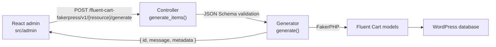

<div align="center">

# Fluent Cart FakerPress

[](https://github.com/mralaminahamed/fluent-cart-fakerpress/releases)
[](https://wordpress.org/)
[](https://php.net/)
[](LICENSE)

Generate realistic test data for Fluent Cart stores — 17 generators, live preview, batch queue, and a modern admin UI.

</div>

> [!WARNING]
> This plugin writes large volumes of fake data directly into your store. Use it only on development or staging sites, and back up your database before generating large datasets.


## Quick Start

Fluent Cart FakerPress is distributed from GitHub. Download the latest release zip and install it from **Plugins → Add New → Upload Plugin**, then **Activate**. The plugin appears as **FC FakerPress** in the admin menu.

To run it from source instead:

```bash
git clone https://github.com/mralaminahamed/fluent-cart-fakerpress.git
cd fluent-cart-fakerpress
composer install
yarn install
yarn build
```

Requires [Fluent Cart](https://wordpress.org/plugins/fluent-cart/), declared as a hard dependency via the `Requires Plugins` header — WordPress blocks activation until Fluent Cart is installed and active. Minimum WordPress 5.0, PHP 7.4, tested up to WordPress 6.8; `readme.txt` and the plugin header are the source of truth. Node.js 16+ is needed for development only.

## What It Does

Fluent Cart FakerPress populates your Fluent Cart store with realistic fake data for development, testing, and demos. Choose a generator, configure the parameters, and click Generate. Every record is created through native Fluent Cart models, so it respects the same schema, relationships, and money handling as real data.

- Developing features that need existing store data
- Testing plugins, themes, and integrations against realistic datasets
- Building client demos with populated catalogs and order histories
- Performance testing with large datasets

## Generators

Seventeen generators, grouped by category in the admin.

| Generator | Category | Description |
|-----------|----------|-------------|
| Products | Core | Sellable products — post, product detail, and variation rows with pricing, stock, and SKUs |
| Customers | Core | Customer profiles with billing and shipping addresses, demographics, and purchase history |
| Orders | Core | Complete orders with line items, billing/shipping addresses, applied coupons, payment, and tax |
| Coupons | Core | Discount codes (fixed, percentage, free shipping) with usage limits and restrictions |
| Product Variations | Advanced | Additional priced variations attached to existing products, with unique SKUs |
| Shipping Plans | Advanced | Shipping methods and zones with fixed and free-shipping rates |
| Tax Classes | Advanced | Tax classes with geographic rate rows Fluent Cart applies to orders |
| Transactions | Advanced | Payment transactions tied to real orders, with gateways and statuses |
| Cart Sessions | Advanced | Abandoned and completed cart sessions with real product foreign keys |
| Attributes | Advanced | Attribute groups and terms, linked to real product variations |
| Refunds | Advanced | Full and partial refunds against existing charge transactions |
| Logs | Advanced | Activity log entries across orders, products, customers, and system events |
| Shipping Classes | Advanced | Shipping classes that group products with similar shipping requirements |
| Labels | Advanced | Labels (tags) attached to existing orders and customers |
| Order Tax Lines | Advanced | Per-order tax lines linking orders to tax rates with collected tax |
| Product Downloads | Advanced | Downloadable files for products, with download permissions on existing orders |
| Subscriptions | Advanced | Subscription records against existing orders (active billing requires Fluent Cart Pro) |

## Features

| Feature | Description |
|---------|-------------|
| Design-token UI | Light/dark themes, accent palettes, and comfortable/compact density — all scoped to the plugin so WordPress chrome is never restyled |
| Live preview | A read-only REST preview route returns real faker rows without persisting anything; the table refreshes as you change settings and re-rolls on Shuffle |
| Command palette | <kbd>Cmd</kbd>/<kbd>Ctrl</kbd>+<kbd>K</kbd> to quick-jump to any generator or page |
| Batch queue | Queue multiple generators and run them sequentially from the batch tray, with live progress |
| Run history | Per-generator run log in browser localStorage; recent runs in the sidebar, all-time stats on the dashboard |
| Settings | Default count, locale, seed, metadata preference, run-history limit, and sample-data sync |
| Sample data sync | One-click download of locale-specific reference data from the companion repository |
| Hook system | Filters and actions across the generation lifecycle for data customization |
| REST API | 17 controllers under `fluent-cart-fakerpress/v1` |
| MCP integration | Optional — expose every generator as an AI tool via the WordPress Abilities API |

## Development

```bash
# JavaScript
yarn start                   # Webpack watch mode
yarn build                   # Production build

# PHP
composer test                # PHPUnit
composer lint                # WordPress coding standards (phpcs)
composer format              # Auto-fix coding standards (phpcbf)
composer analyse             # Static analysis (PHPStan)
composer test:coverage       # HTML coverage report
composer makepot             # Regenerate the translation template
composer release             # Lint + analyse + build + makepot + zip
composer zip:dev             # Build a development zip in release/dev/
```

## Architecture



PHP lives under the PSR-4 namespace `FluentCartFakerPress\`:

```
fluent-cart-fakerpress.php           Plugin bootstrap
class-fluent-cart-fakerpress.php     Singleton orchestrator
includes/
  Abstracts/Generator.php            Base generator (FakerPHP, batch, logging)
  Abstracts/Controller.php           Base REST controller (WP_REST_Controller)
  Generators/                        17 concrete generators
  Controllers/                       17 REST controllers
  MCP/                               MCP server + abilities
```

The admin app is React 18, React Router v7, Radix UI, and Tailwind CSS v4. Entry point `src/index.tsx`, built to `build/`. The compiled bundle is the only JS shipped; the readable source lives in this repository.

## Extensibility

```php
// Modify generated data before creation
add_filter( 'fluent_cart_fakerpress_customer_data_before_create', function( $data ) {
    $data['first_name'] = 'Test';
    return $data;
} );

// Hook after an item is created
add_action( 'fluent_cart_fakerpress_after_customer_created', function( $customer_id, $result, $data ) {
    // custom logic
}, 10, 3 );

// Filter a generation result
add_filter( 'fluent_cart_fakerpress_product_generation_result', function( $result, $product_id, $data ) {
    return $result;
}, 10, 3 );
```

## External Services

Two outbound requests, both administrator-initiated. Neither sends any site, user, or store data.

| Service | Endpoint | Triggered by | Data sent |
|---------|----------|--------------|-----------|
| GitHub | `github.com/mralaminahamed/fluent-cart-fakerpress-sample-data/archive/refs/heads/<branch>.zip` | Clicking **Sync Sample Data** in Settings, or a generator needing sample data not yet downloaded | Unauthenticated `GET`; no payload |
| WordPress.org | `api.wordpress.org/plugins/info/1.2/` | Opening the **Our Plugins** page; the request is made by the browser | Author query string only; no payload |

GitHub [terms](https://docs.github.com/en/site-policy/github-terms/github-terms-of-service) and [privacy policy](https://docs.github.com/en/site-policy/privacy-policies/github-general-privacy-statement). WordPress.org [about](https://wordpress.org/about/) and [privacy policy](https://wordpress.org/about/privacy/).

## Security

- All REST endpoints require the `manage_options` capability
- Parameters are validated against JSON Schema before processing
- Generated data is fictional and intended for non-production use only
- Generated data stays in your own database; no analytics, telemetry, or phone-home

Report vulnerabilities privately — see the [security policy](SECURITY.md).

## Changelog

The version history lives in [docs/changelog.md](docs/changelog.md). [`readme.txt`](readme.txt) carries the most recent releases in the WordPress plugin format.

## Contributing

Bug reports, feature requests, and pull requests are welcome. Read the [development guide](docs/development.md) before opening a pull request, and file issues on the [issue tracker](https://github.com/mralaminahamed/fluent-cart-fakerpress/issues).

## Maintainer

Al Amin Ahamed — [alaminahamed.com](https://alaminahamed.com) · [@mralaminahamed](https://github.com/mralaminahamed)

## License

[GPL-2.0-or-later](LICENSE)
