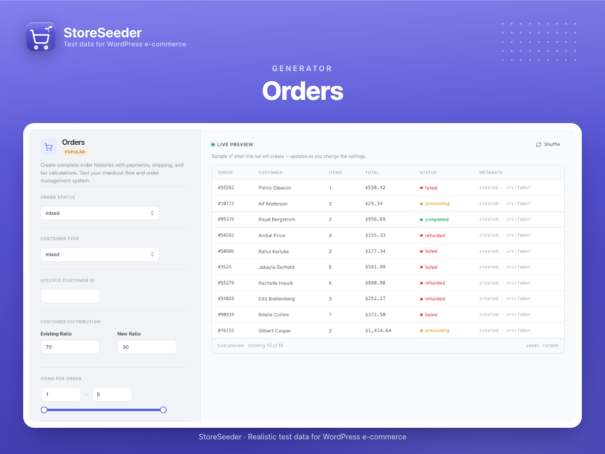
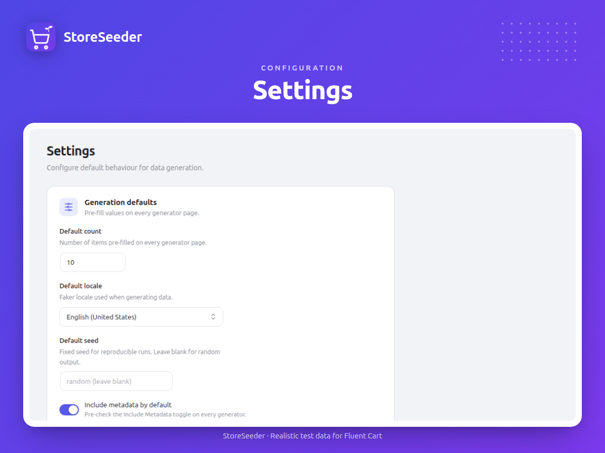
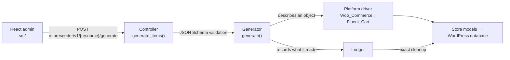

<div align="center">

# StoreSeeder

[](https://wordpress.org/plugins/storeseeder/)
[](https://wordpress.org/plugins/storeseeder/)
[](https://wordpress.org/plugins/storeseeder/)
[](https://wordpress.org/plugins/storeseeder/advanced/)
[](LICENSE)

Realistic test data for WordPress e-commerce — 21 generators, whole shops from a recipe, one driver per store plugin, live preview, batch queue, and a modern admin UI.

</div>

> [!WARNING]
> This plugin writes large volumes of fake data directly into your store, and its cleanup deletes records. Use it only on development or staging sites, and back up your database before generating large datasets.


## Quick Start

Install from the WordPress admin — **Plugins → Add New**, search for "StoreSeeder", then **Install Now** and **Activate**.

To run it from source instead:

```bash
git clone https://github.com/mralaminahamed/storeseeder.git
cd storeseeder
composer install
yarn install
yarn build
```

Needs a supported store plugin — [WooCommerce](https://wordpress.org/plugins/woocommerce/) or [Fluent Cart](https://wordpress.org/plugins/fluent-cart/) — active before it can seed anything. Minimum WordPress, PHP, and tested-up-to versions are shown in the badges above; `readme.txt` and the plugin header are the source of truth. Node.js 20+ is needed for development only.

## What It Does

StoreSeeder populates a store with realistic fake data for development, testing, and demos. Choose a generator, configure the parameters, and click Generate — or run a recipe and get a whole shop at once.

- Developing features that need existing store data
- Testing plugins, themes, and integrations against realistic datasets
- Building client demos with populated catalogs and order histories
- Performance testing with large datasets

Everything it creates is recorded in a ledger, so cleanup removes what StoreSeeder made and leaves what you made.

## Platforms

Generators never call a store plugin directly. They describe an object; the driver for the active platform decides what that means — which is why the same recipe produces a comparable store on either platform, and why a third is a driver rather than a fork.

| Platform | Status | Notes |
|----------|--------|-------|
| WooCommerce | Ships | HPOS-safe: `WC_Order` CRUD, `wc_get_orders()`, compatibility declared |
| Fluent Cart | Ships | Full generator coverage |
| Anything else | Register your own | Implement `Platform_Interface` and select it via `storeseeder_target_platform` |

## Generators

Twenty-one generators, grouped by category in the admin.

| Generator | Category | Description |
|-----------|----------|-------------|
| Products | Core | Products with pricing, categories, inventory, and downloads |
| Customers | Core | Customer profiles with addresses and purchase history |
| Orders | Core | Complete order histories with payments, shipping, and tax |
| Coupons | Core | Discount codes with rules, usage limits, and restrictions |
| Product Variations | Catalog | Variable product attributes, price variance, and stock |
| Product Categories | Catalog | Category trees |
| Product Tags | Catalog | Product tags |
| Brands | Catalog | Brand terms |
| Attributes | Catalog | Product attribute types for variations |
| Product Downloads | Catalog | Downloadable-product files |
| Refunds | Orders | Refunds issued against real generated orders |
| Transactions | Orders | Payment records across multiple gateways and statuses |
| Cart Sessions | Orders | Cart-abandonment scenarios and session data |
| Subscriptions | Orders | Recurring subscription records |
| Tax Classes | Store config | Tax classes |
| Order Tax Rates | Store config | Tax rates applied to orders |
| Shipping Classes | Store config | Shipping classes |
| Shipping Plans | Store config | Shipping methods, zones, and rate tables |
| Licenses | Extras | Licence keys |
| Labels | Extras | Shipping labels |
| Logs | Extras | Store log entries |

## Features

| Feature | Description |
|---------|-------------|
| Platform drivers | One driver per store plugin; generators stay platform-agnostic |
| Recipes | A whole shop from one definition, rather than generator-by-generator |
| Ledger + cleanup | Every generated record is tracked, so cleanup is exact rather than a guess |
| Live preview | Sample rows without persisting anything, re-rolled on Shuffle |
| Batch queue | Queue multiple generators and run them sequentially with live progress |
| Capability probing | Drivers report what they support, so the UI only offers what the store can do |
| Locales | Locale-aware data, with reference data synced on demand |
| WP-CLI | `wp storeseeder <command>` — generate, recipe, preview, sample-data, cleanup, platforms |
| MCP | Abilities exposed to an MCP client, so an agent can seed a store |
| REST API | 21 controllers under `storeseeder/v1` |
| E2E suite | 85 Playwright tests across the admin UI |

## Screenshots

<details>
<summary>View all screenshots</summary>

### Generator page


Schema-driven configuration on the left, a live preview table on the right, and a sticky run bar.

### Recipes


A whole shop from one definition — products, customers, orders and the rest in a single run.

### Batch queue



Queue several generators and run them sequentially, with progress reported as each completes.

### Cleanup



Removes what StoreSeeder created, using the ledger — your own data is left alone.

</details>

## Development

```bash
# JavaScript
yarn start                   # Webpack watch mode
yarn build                   # Production build
yarn lint:js                 # Lint JS

# PHP
composer test                # PHPUnit
composer phpcs               # WordPress coding standards lint
composer phpcbf              # Auto-fix coding standards
composer phpstan             # Static analysis (level 7)
composer release             # Lint + analyse + build + makepot + zip

# End-to-end tests
yarn test:e2e:setup          # Configure the WP test environment
yarn test:e2e                # Run all 85 Playwright tests
yarn test:e2e:ui             # Playwright interactive UI
yarn test:e2e:report         # Open the HTML test report
```

Some PHPUnit tests skip when a platform is not installed — the Fluent Cart tests skip on a site that only has WooCommerce. A skip is not a pass; read what it says before assuming coverage.

## Architecture



PHP lives under the PSR-4 namespace `StoreSeeder\`:

```
storeseeder.php                      Plugin bootstrap, HPOS declaration, autoloader guard
class-storeseeder.php                Singleton orchestrator
includes/
  Generation/Generator.php           Base generator (FakerPHP, batch, logging)
  Generation/Generators/             21 concrete generators
  Generation/Ledger.php              Records every generated object
  Generation/Purge.php               Cleanup, driven by the ledger
  Platforms/Platform_Interface.php   The driver contract
  Platforms/Drivers/                 Woo_Commerce, Fluent_Cart
  Platforms/Capability.php           What a driver can and cannot do
  Recipes/                           Whole-shop definitions
  Rest/Controllers/                  21 REST controllers
  CLI/Commands/                      generate, recipe, preview, sample-data, cleanup, platforms
  MCP/                               MCP server + abilities
  Access.php                         Capability gate (manage_options)
```

The admin app is React with Tailwind CSS. Entry point `src/index.tsx`, built to `build/`. The compiled bundle is the only JS shipped to WordPress.org; the readable source lives in this repository.

## Extensibility

```php
// Choose which platform is seeded
add_filter( 'storeseeder_target_platform', function( $platform ) {
    return 'woocommerce';
} );

// Adjust request parameters before generation
add_filter( 'storeseeder_rest_params', function( $params, $request ) {
    $params['count'] = min( $params['count'], 50 );
    return $params;
}, 10, 2 );

// Hook after an item is created
add_action( 'storeseeder_after_customer_created', function( $customer_id, $data ) {
    // custom logic
}, 10, 2 );

// Register your own recipes, CLI commands, REST controllers or MCP abilities
add_filter( 'storeseeder_recipes', function( $recipes ) { return $recipes; } );
add_filter( 'storeseeder_cli_commands', function( $commands ) { return $commands; } );
add_filter( 'storeseeder_rest_controllers', function( $controllers ) { return $controllers; } );
add_filter( 'storeseeder_mcp_abilities', function( $abilities ) { return $abilities; } );

// Restrict who may seed (default: manage_options)
add_filter( 'storeseeder_capability', function( $cap ) {
    return 'manage_options';
} );
```

## External Services

Outbound requests are administrator-initiated. Neither sends any site, user, or store data.

| Service | Endpoint | Triggered by | Data sent |
|---------|----------|--------------|-----------|
| GitHub | Sample-data archive, and `github.com/WordPress/mcp-adapter/releases` | After an administrator grants consent, or opens the MCP settings | Unauthenticated `GET`; no payload |
| WordPress.org | `api.wordpress.org/plugins/info/1.2/` | Opening the **Our Plugins** page; the request is made by the browser | Author query string only; no payload |

GitHub [terms](https://docs.github.com/en/site-policy/github-terms/github-terms-of-service) and [privacy policy](https://docs.github.com/en/site-policy/privacy-policies/github-general-privacy-statement). WordPress.org [about](https://wordpress.org/about/) and [privacy policy](https://wordpress.org/about/privacy/).

## Security

- All REST endpoints require the `manage_options` capability, filterable via `storeseeder_capability`
- Parameters are validated against JSON Schema before processing
- Generated data is fictional and intended for non-production use only
- Cleanup deletes only what the ledger recorded as generated
- Generated data stays in your own database; no analytics, telemetry, or phone-home

Report vulnerabilities privately — see the [security policy](SECURITY.md).

## Changelog

The complete version history lives in [CHANGELOG.md](CHANGELOG.md), in [Keep a Changelog](https://keepachangelog.com/en/1.1.0/) format. [`readme.txt`](readme.txt) carries only the most recent releases, which is what WordPress.org recommends, and is rendered on the [WordPress.org changelog page](https://wordpress.org/plugins/storeseeder/#developers).

## Contributing

Bug reports, feature requests, and pull requests are welcome. Read the [contributing guide](CONTRIBUTING.md) before opening a pull request, and file issues on the [issue tracker](https://github.com/mralaminahamed/storeseeder/issues).

## Maintainer

Al Amin Ahamed — [alaminahamed.com](https://alaminahamed.com) · [@mralaminahamed](https://github.com/mralaminahamed)

## License

[GPL-2.0-or-later](LICENSE)
