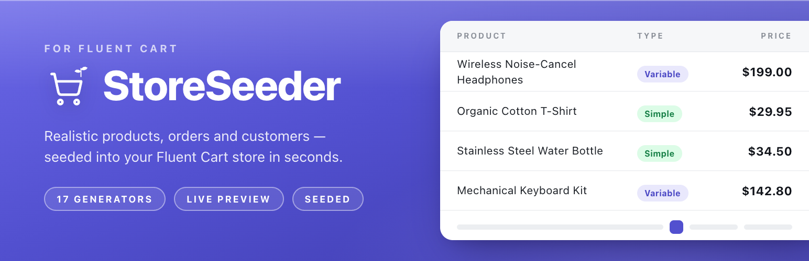
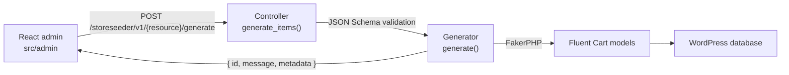

<div align="center">


# StoreSeeder

**Realistic test data for Fluent Cart stores.**
17 generators, live preview, batch queue, and a modern admin UI.

[](https://github.com/mralaminahamed/storeseeder/releases)
[](https://wordpress.org/)
[](readme.txt)
[](https://php.net/)
[](LICENSE)

</div>

> [!WARNING]
> StoreSeeder writes large volumes of fake data directly into your store. Use it only on development
> or staging sites, and back up your database before generating large datasets.



## What It Does

Pick a generator, configure its parameters, click **Generate**. Every record is created through native
Fluent Cart models, so it respects the same schema, relationships, validation, and money handling as
real data — and stays compatible across Fluent Cart updates.

Built for:

- Developing features that need a store with existing data
- Testing plugins, themes, and integrations against realistic datasets
- Building client demos with populated catalogs and order histories
- Performance testing at volume

## Quick Start

StoreSeeder is heading to the WordPress.org plugin directory; releases are cut from this repository by
pushing a version tag (see [Releases](#releases)). Until the listing is live, install from a
[release zip](https://github.com/mralaminahamed/storeseeder/releases) via **Plugins → Add New → Upload
Plugin**, then **Activate**. It appears as **StoreSeeder** in the admin menu.

To run from source:

```bash
git clone https://github.com/mralaminahamed/storeseeder.git
cd storeseeder
composer install
yarn install
yarn build
```

**Requirements** — WordPress 6.5+, PHP 7.4+ (8.0+ recommended), and
[Fluent Cart](https://wordpress.org/plugins/fluent-cart/) active. Fluent Cart is a hard dependency
declared through the `Requires Plugins` header, so WordPress blocks activation without it. Budget
256MB of memory, or 512MB for large datasets. The plugin header and [`readme.txt`](readme.txt) are the
source of truth for these numbers.

## Generators

Seventeen generators, grouped by category in the admin. Several build on others — orders need products
and customers, refunds need charge transactions — and each one reports clearly when a prerequisite is
missing.

| Generator | Category | What it creates |
|-----------|----------|-----------------|
| Products | Core | Sellable products — post, product detail, and variation rows with pricing, stock, and SKUs |
| Customers | Core | Customer profiles with billing and shipping addresses, demographics, and purchase history |
| Orders | Core | Complete orders with line items, addresses, applied coupons, payment, shipping, and tax |
| Coupons | Core | Discount codes (fixed, percentage, free shipping) with usage limits and restrictions |
| Product Variations | Advanced | Additional priced variations attached to existing products, with unique SKUs |
| Shipping Plans | Advanced | Shipping methods and zones with fixed and free-shipping rates |
| Shipping Classes | Advanced | Classes that group products with similar shipping requirements |
| Tax Classes | Advanced | Tax classes with the geographic rate rows Fluent Cart applies to orders |
| Order Tax Lines | Advanced | Per-order tax lines linking orders to tax rates with collected tax |
| Transactions | Advanced | Payment transactions tied to real orders, with gateways and statuses |
| Refunds | Advanced | Full and partial refunds against existing charge transactions |
| Attributes | Advanced | Attribute groups and terms, linked to real product variations |
| Cart Sessions | Advanced | Abandoned and completed cart sessions with real product foreign keys |
| Labels | Advanced | Labels (tags) attached to existing orders and customers |
| Product Downloads | Advanced | Downloadable files for products, with download permissions on existing orders |
| Subscriptions | Advanced | Subscription records against existing orders (active billing requires Fluent Cart Pro) |
| Logs | Advanced | Activity log entries across orders, products, customers, and system events |

Full per-generator detail in [docs/features.md](docs/features.md).

## Features

| Feature | Description |
|---------|-------------|
| Live preview | A read-only REST route returns real faker rows without persisting anything; the table refreshes as you change settings and re-rolls on Shuffle |
| Schema-driven forms | Each generator renders its own fields from a parameter schema — nested options, ranges, toggles, sensible defaults |
| Batch queue | Queue multiple generators and run them sequentially from the batch tray, with live progress |
| Command palette | <kbd>Cmd</kbd>/<kbd>Ctrl</kbd>+<kbd>K</kbd> to jump to any generator or page |
| Run history | Per-generator run log in browser `localStorage`; recent runs in the sidebar, all-time stats on the dashboard |
| Design-token UI | Light/dark themes, accent palettes, and comfortable/compact density — all scoped to the plugin, so WordPress chrome is never restyled |
| Settings | Default count, locale, reproducible seed, metadata preference, run-history limit, and sample-data sync |
| Sample data | Optional, consent-gated download of locale reference data; declining leaves generators on built-in defaults |
| REST API | 17 controllers under `storeseeder/v1`, each with `generate` and `preview` routes |
| MCP integration | Optional — expose every generator as an AI tool via the WordPress Abilities API |
| Hook system | Filters and actions across the generation lifecycle |

## Documentation

| Page | What it covers |
|------|----------------|
| [docs/](docs/README.md) | Documentation index |
| [Installation](docs/installation.md) | Requirements, install paths, activation with Fluent Cart |
| [Usage](docs/usage.md) | Running generators, live preview, batch queue, settings, run history |
| [Features](docs/features.md) | The 17 generators and what each writes into the store |
| [Architecture](docs/architecture.md) | Request flow from the React admin through controllers, generators, and models |
| [Development](docs/development.md) | Local setup, build and test commands, adding a generator, release process |
| [External Services](docs/external-services.md) | The two outbound requests, what they send, and how to opt out |
| [CHANGELOG.md](CHANGELOG.md) | Full version history — the canonical record |
| [CONTRIBUTING.md](CONTRIBUTING.md) | Branching, commit conventions, quality gates, PR expectations |
| [SECURITY.md](SECURITY.md) | Private vulnerability reporting and the plugin's security measures |
| [SUPPORT.md](SUPPORT.md) | Where to ask, what to include, what is out of scope |

## Architecture



PHP lives under the PSR-4 namespace `StoreSeeder\`:

```
storeseeder.php           Plugin bootstrap
class-storeseeder.php     Singleton orchestrator
includes/
  Abstracts/Generator.php            Base generator (FakerPHP, batch, preview, logging)
  Abstracts/Controller.php           Base REST controller (WP_REST_Controller)
  Generators/                        17 concrete generators
  Controllers/                       17 REST controllers
  MCP/                               MCP server + abilities
```

The admin app is React 18, React Router v7, Radix UI, and Tailwind CSS v4, entered at
`src/admin/index.tsx` and built to `build/`. The compiled bundle is the only JavaScript shipped; the
readable source lives in this repository.

## Development

```bash
# Frontend
yarn start                   # webpack watch mode
yarn build                   # production build
yarn test:e2e                # Playwright end-to-end suite
yarn test:e2e:ui             # Playwright UI mode

# PHP
composer test                # PHPUnit
composer test:coverage       # HTML coverage report
composer lint                # WordPress coding standards (phpcs)
composer format              # Auto-fix coding standards (phpcbf)
composer analyse             # Static analysis (PHPStan, level 7)
composer phpcs:plugin-review # WordPress.org plugin review ruleset
composer makepot             # Regenerate the translation template
composer release             # Lint + analyse + build + makepot + zip
composer zip:dev             # Development zip at release/dev/storeseeder.zip
```

Node and Yarn are pinned: `packageManager` fixes Yarn at 4.18, provisioned by Corepack, and CI builds
on Node 24. See [CONTRIBUTING.md](CONTRIBUTING.md) for the full setup and the checks a pull request
has to pass.

## Extensibility

```php
// Modify generated data before creation
add_filter( 'storeseeder_customer_data_before_create', function( $data ) {
    $data['first_name'] = 'Test';
    return $data;
} );

// Hook after an item is created
add_action( 'storeseeder_after_customer_created', function( $customer_id, $result, $data ) {
    // custom logic
}, 10, 3 );

// Filter a generation result
add_filter( 'storeseeder_product_generation_result', function( $result, $product_id, $data ) {
    return $result;
}, 10, 3 );
```

More hooks, with copy-paste examples, in [docs/architecture.md](docs/architecture.md).

## External Services

Two outbound requests, both administrator-initiated. Neither sends any site, user, or store data, and
neither fires on activation.

| Service | Endpoint | Triggered by |
|---------|----------|--------------|
| GitHub | `github.com/mralaminahamed/storeseeder-sample-data-fluent-cart/archive/refs/heads/<branch>.zip` | An administrator granting consent — the prompt on the plugin admin page, or **Sync now** in Settings |
| WordPress.org | `api.wordpress.org/plugins/info/1.2/` | An administrator opening the **Our Plugins** page; requested by the browser |

Full disclosure — exactly what each request sends and receives, provider terms and privacy policies,
and what StoreSeeder deliberately does not do — in
[docs/external-services.md](docs/external-services.md).

## Security

- Every REST endpoint requires the `manage_options` capability
- Parameters are validated against JSON Schema before processing
- Sample-data archives are validated entry by entry before extraction, rejecting absolute paths and
  `..` traversal segments (zip-slip)
- Generated data stays in your own database — no analytics, telemetry, or phoning home
- Generated content is fictional and intended for non-production use only

Report vulnerabilities privately — see the [security policy](SECURITY.md).

## Releases

Pushing a version tag from this repository triggers
[`svn-deploy.yml`](.github/workflows/svn-deploy.yml), which validates that the tag matches the plugin
header version, runs the lint and static-analysis gates, builds the assets and translation template,
packages the plugin, deploys it to the WordPress.org SVN repository, and publishes the GitHub release.

Version history lives in [CHANGELOG.md](CHANGELOG.md); [`readme.txt`](readme.txt) carries the four
most recent releases in the WordPress plugin format.

## Contributing

Bug reports, feature requests, and pull requests are all welcome. Read
[CONTRIBUTING.md](CONTRIBUTING.md) for setup, coding standards, and the checks a pull request needs to
pass, and [docs/development.md](docs/development.md) for architecture detail. File issues on the
[issue tracker](https://github.com/mralaminahamed/storeseeder/issues); for help using the plugin, see
[SUPPORT.md](SUPPORT.md). Participation is covered by the
[Code of Conduct](CODE_OF_CONDUCT.md).

## Maintainer

Al Amin Ahamed — [alaminahamed.com](https://alaminahamed.com) · [@mralaminahamed](https://github.com/mralaminahamed)

## License

[GPL-2.0-or-later](LICENSE)
