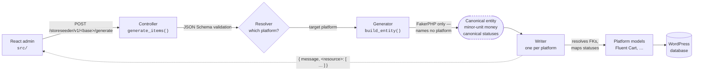

<div align="center">


# StoreSeeder

**Realistic test data for WordPress e-commerce platforms.**
19 generators, one platform driver per store plugin, live preview, batch queue, and a modern admin UI.

[](https://github.com/mralaminahamed/storeseeder/releases)
[](https://wordpress.org/)
[](readme.txt)
[](https://php.net/)
[](LICENSE)

</div>

> [!WARNING]
> StoreSeeder writes large volumes of fake data directly into your store. Use it only on development
> or staging sites, and back up your database before generating large datasets.


## What It Does

Pick a generator, configure its parameters, click **Generate**. Every record is created through the
target platform's own models, so it respects the same schema, relationships, validation, and money
handling as real data — and stays compatible across that platform's updates.

Which store the data lands in is a choice, not a build-time assumption: a **platform driver** owns
that, and the same nineteen generators feed every driver. Fluent Cart and WooCommerce ship today.

Built for:

- Developing features that need a store with existing data
- Testing plugins, themes, and integrations against realistic datasets
- Building client demos with populated catalogs and order histories
- Performance testing at volume

## Quick Start

StoreSeeder is heading to the WordPress.org plugin directory; releases are cut from this repository by
pushing a version tag (see [Releases](#releases)). Until the listing is live, install from a
[release zip](https://github.com/mralaminahamed/storeseeder/releases) via **Plugins → Add New → Upload
Plugin**, then **Activate**. It appears as **StoreSeeder** in the admin menu.

To run from source:

```bash
git clone https://github.com/mralaminahamed/storeseeder.git
cd storeseeder
composer install
yarn install
yarn build
```

**Requirements** — WordPress 6.5+, PHP 7.4+ (8.0+ recommended), and one supported e-commerce
platform active. Today that means [Fluent Cart](https://wordpress.org/plugins/fluent-cart/).

There is deliberately **no `Requires Plugins` header**: it would make WordPress refuse activation
without Fluent Cart specifically, so no other platform could ever be reached. StoreSeeder activates
regardless and says what is missing instead. Budget 256MB of memory, or 512MB for large datasets. The
plugin header and [`readme.txt`](readme.txt) are the source of truth for these numbers.

## Platforms

| Platform | Status |
|----------|--------|
| [Fluent Cart](https://wordpress.org/plugins/fluent-cart/) | Shipped — all 19 resources; licences need Fluent Cart Pro |
| [WooCommerce](https://wordpress.org/plugins/woocommerce/) | Shipped — 16 of 19 resources; subscriptions need WooCommerce Subscriptions. Transactions, labels and licences are reported unsupported with the reason, because WooCommerce has no equivalent |
| EasyCommerce, StoreEngine | Planned |
| Anything else | A third party can register a driver from their own plugin, with no changes here |

The target is chosen in the topbar and in **Settings**, and defaults to `Auto`. One platform active
resolves silently; with several active there is no safe default, so the generator page asks before it
runs — writing rows into the wrong store is not a failure you would notice afterwards. The choice is
stored **site-wide**, so two administrators cannot unknowingly seed different platforms.

Support is computed per request, never cached, because it is conditional: WooCommerce has no
subscriptions until WooCommerce Subscriptions is active, and StoreEngine gates several resources
behind addons. A resource the target cannot represent is dimmed with its reason — naming the plugin
that would enable it — and the REST API answers 400 rather than reporting success and writing
nothing.

## Generators

Nineteen generators, grouped by category in the admin, all platform-neutral — a generator names no
platform, which is what lets one of them feed every driver and lets a fixed seed produce identical
data on all of them. Several build on others — orders need products and customers, refunds need charge
transactions — and each one reports clearly when a prerequisite is missing.

| Generator | Category | What it creates |
|-----------|----------|-----------------|
| Products | Core | Sellable products — post, product detail, and variation rows with pricing, stock, and SKUs |
| Customers | Core | Customer profiles with billing and shipping addresses, demographics, and purchase history |
| Orders | Core | Complete orders with line items, addresses, applied coupons, payment, shipping, and tax |
| Coupons | Core | Discount codes (fixed, percentage, free shipping) with usage limits and restrictions |
| Product Variations | Advanced | Additional priced variations attached to existing products, with unique SKUs |
| Attributes | Advanced | Attribute groups and terms, linked to real product variations |
| Brands | Advanced | Product brands attached to existing products, optionally nested as sub-brands. `product_brand` on WooCommerce, `product-brands` on Fluent Cart |
| Product Downloads | Advanced | Downloadable files for products, with download permissions on existing orders |
| Cart Sessions | Advanced | Abandoned and completed cart sessions with real product foreign keys |
| Transactions | Advanced | Payment transactions tied to real orders, with gateways and statuses |
| Refunds | Advanced | Full and partial refunds against existing charge transactions |
| Subscriptions | Advanced | Subscription records against existing orders (on Fluent Cart, active billing requires Pro) |
| Licenses | Advanced | Software licences against existing orders — keys, site limits, activation counts and expiry. Requires Fluent Cart Pro, which owns the licensing tables |
| Labels | Advanced | Labels (tags) attached to existing orders and customers |
| Tax Classes | Advanced | Tax classes with the geographic rate rows the platform applies to orders |
| Order Tax Lines | Advanced | Per-order tax lines linking orders to tax rates with collected tax |
| Shipping Plans | Advanced | Shipping methods and zones with fixed and free-shipping rates |
| Shipping Classes | Advanced | Classes that group products with similar shipping requirements |
| Logs | Advanced | Activity log entries across orders, products, customers, and system events |

Full per-generator detail in [docs/features.md](docs/features.md).

## Features

| Feature | Description |
|---------|-------------|
| Live preview | A read-only REST route returns real faker rows without persisting anything; the table refreshes as you change settings and re-rolls on Shuffle |
| Schema-driven forms | Each generator renders its own fields from a parameter schema — nested options, ranges, toggles, sensible defaults |
| Batch queue | Queue multiple generators and run them sequentially from the batch tray, with live progress |
| Command palette | <kbd>Cmd</kbd>/<kbd>Ctrl</kbd>+<kbd>K</kbd> to jump to any generator or page |
| Run history | Per-generator run log in browser `localStorage`; recent runs in the sidebar, all-time stats on the dashboard |
| Design-token UI | Light/dark themes, accent palettes, and comfortable/compact density — all scoped to the plugin, so WordPress chrome is never restyled |
| Multi-platform | One driver per store plugin; the target is site-wide, and capabilities are resolved per request rather than declared once |
| 75 locales | Every locale FakerPHP ships a provider for, searchable by name or code. The picker offers exactly what the REST API accepts |
| Settings | Grouped by scope — site-wide (target platform, who may generate, sample data) and per-browser (defaults, appearance, run history), saved as you change them |
| Access control | Grant roles from Settings, or set the capability in code. Administrators cannot be locked out, and only they can grant others |
| Sample data | Optional, consent-gated download of locale reference data; declining leaves generators on built-in defaults |
| Delete generated data | One action clears what StoreSeeder created — tracked in its own ledger, so your data is never matched on |
| REST API | 19 controllers under `storeseeder/v1`, each with `generate` and `preview` routes |
| WP-CLI | `wp storeseeder generate\|preview\|platforms\|locales\|sample-data\|cleanup`, dispatching through the same REST controllers |
| Translation-ready | Textdomain and JS translations both resolve from the plugin's own `languages/`, so Loco Translate and WPML String Translation find every string |
| MCP integration | Optional — two AI tools per generator, one read-only and one that writes, with a Settings switch per risk class. Clients connect through [`mcp-wordpress-remote`](https://github.com/Automattic/mcp-wordpress-remote) |
| Hook system | Filters and actions across the generation lifecycle, plus one filter for the capability required to use the plugin |

## Documentation

| Page | What it covers |
|------|----------------|
| [docs/](docs/README.md) | Documentation index |
| [Installation](docs/installation.md) | Requirements, install paths, and choosing a target platform |
| [Usage](docs/usage.md) | Running generators, live preview, batch queue, settings, run history |
| [Features](docs/features.md) | The 19 generators, the platform matrix, locales, and what each generator writes |
| [Architecture](docs/architecture.md) | The platform driver layer, request flow, extension points, and honest scale limits |
| [Development](docs/development.md) | Local setup, build and test commands, adding a generator, release process |
| [External Services](docs/external-services.md) | The two outbound requests, what they send, and how to opt out |
| [CHANGELOG.md](CHANGELOG.md) | Full version history — the canonical record |
| [CONTRIBUTING.md](CONTRIBUTING.md) | Branching, commit conventions, quality gates, PR expectations |
| [SECURITY.md](SECURITY.md) | Private vulnerability reporting and the plugin's security measures |
| [SUPPORT.md](SUPPORT.md) | Where to ask, what to include, what is out of scope |

## Architecture



The entity in the middle is the whole point: a generator produces platform-neutral data, and a
writer is the only thing that knows what store it is going into. That is what lets the same
nineteen generators seed any supported platform, and what lets a fixed seed produce identical
data on all of them.

PHP lives under the PSR-4 namespace `StoreSeeder\`:

```
storeseeder.php           Plugin bootstrap
class-storeseeder.php     Singleton orchestrator
includes/
  Access.php                         One capability gate: menu, REST, MCP, AJAX
  Generation/Generator.php           Base generator (FakerPHP, batch, preview, logging)
  Generation/Generators/             17 concrete generators — no platform knowledge
  Rest/Controller.php                Base REST controller (WP_REST_Controller)
  Rest/Controllers/                  17 REST controllers
  Rest/Registry.php                  Controller registry — storeseeder_rest_controllers
  Platforms/                         Platform layer: registry, resolver, capabilities
  Platforms/Locale.php               The 75 generatable locales
  Platforms/Writer.php               Base writer — persists one resource
  Platforms/Drivers/Fluent_Cart/     Driver: capability matrix + 19 writers
  Platforms/Drivers/Woo_Commerce/    Driver: matrix + shared Writer base + 16 writers
  MCP/                               MCP server + abilities
```

The admin app is React 18, React Router v7, Radix UI, and Tailwind CSS v4, entered at
`src/index.tsx` and built to `build/`. The compiled bundle is the only JavaScript shipped; the
readable source lives in this repository.

## Command line

Every command goes through the same REST controllers the admin uses, so the two cannot
disagree about what a parameter means or what is valid.

```bash
# Generate. Any parameter the resource's endpoint accepts works as a flag.
wp storeseeder generate products --count=20 --locale=de_DE --user=1
wp storeseeder generate products --count=5 --price_range='{"min":5,"max":500}' --user=1
wp storeseeder generate orders --count=100 --seed=42 --payment_methods=stripe,paypal --user=1

# Look before you write: same rows, nothing persisted, no target platform needed.
wp storeseeder preview products --count=3 --format=json --user=1

# Where data goes, and what can be generated in it.
wp storeseeder platforms --user=1
wp storeseeder platforms --set=fluent-cart --user=1
wp storeseeder locales --search=german

# Act on a consent decision already recorded; it never grants one.
wp storeseeder sample-data --user=1
wp storeseeder sample-data sync --force --user=1
```

`--user` is required for anything that writes. StoreSeeder writes rows into a live store, so
the command verifies a real user's capability rather than treating shell access as consent to
write to this particular site — and that keeps one answer to "who may generate?" across the
admin, REST, MCP and the CLI. `wp storeseeder locales` needs no user, because it only reports
what the plugin can do.

Both spellings of a resource work: `cart-sessions` (the REST base) and `cart_session` (the
canonical name). A typo lists the valid ones; an unknown flag lists the parameters that
endpoint accepts.

## Development

```bash
# Frontend
yarn start                   # webpack watch mode
yarn build                   # production build
yarn test:e2e                # Playwright end-to-end suite
yarn test:e2e:ui             # Playwright UI mode

# PHP
composer test                # PHPUnit
composer test:coverage       # HTML coverage report
composer lint                # WordPress coding standards (phpcs)
composer format              # Auto-fix coding standards (phpcbf)
composer analyse             # Static analysis (PHPStan, level 7)
composer phpcs:plugin-review # WordPress.org plugin review ruleset
composer makepot             # Regenerate the translation template (needs build/, so yarn build first)
composer release             # Lint + analyse + build + makepot + zip
composer zip:dev             # Development zip at release/dev/storeseeder.zip
```

Node and Yarn are pinned: `packageManager` fixes Yarn at 4.18, provisioned by Corepack, and CI builds
on Node 24. See [CONTRIBUTING.md](CONTRIBUTING.md) for the full setup and the checks a pull request
has to pass.

## Extensibility

```php
// Register a platform from your own plugin. This is the whole surface needed:
// the generators, REST API and admin pick it up with no changes to StoreSeeder.
add_filter( 'storeseeder_platforms', function ( array $platforms ): array {
    $platforms[] = new My_Store_Driver(); // extends StoreSeeder\Platforms\Platform_Driver
    return $platforms;
} );

// Change generated data before it is written — the entity is platform-neutral here,
// so this applies to every platform equally. Drop the _entity suffix for one resource.
add_filter( 'storeseeder_canonical_entity', function ( array $entity, string $resource ): array {
    $entity['meta']['seeded_by'] = 'nightly-fixture';
    return $entity;
}, 10, 2 );

// Widen who may generate. Governs the admin menu, REST, MCP and AJAX together.
add_filter( 'storeseeder_capability', fn() => 'edit_shop_orders' );

// Observe a write, per platform and resource. Fires for failures too.
add_action( 'storeseeder_after_write_fluent-cart_product', function ( $result, $entity ) {
    // custom logic
}, 10, 2 );
```

The full table — every filter and action, with what each receives — is in
[docs/architecture.md](docs/architecture.md#extension-points).

## External Services

Two outbound requests, both administrator-initiated. Neither sends any site, user, or store data, and
neither fires on activation.

| Service | Endpoint | Triggered by |
|---------|----------|--------------|
| GitHub | `github.com/mralaminahamed/storeseeder-sample-data-fluent-cart/archive/refs/heads/<branch>.zip` | An administrator granting consent — the prompt on the plugin admin page, or **Sync now** in Settings. `storeseeder_sample_data_source` points it elsewhere |
| WordPress.org | `api.wordpress.org/plugins/info/1.2/` | An administrator opening the **Our Plugins** page; requested by the browser |

Full disclosure — exactly what each request sends and receives, provider terms and privacy policies,
and what StoreSeeder deliberately does not do — in
[docs/external-services.md](docs/external-services.md).

## Security

- Every REST endpoint, MCP ability and admin screen requires `manage_options` — or whatever
  `storeseeder_capability` returns, or a role allowed in Settings, all governed together so access
  cannot be widened for one surface and not another
- Granting access is itself restricted to `manage_options`, so a role allowed to generate cannot
  allow further roles
- Parameters are validated against JSON Schema before processing
- Sample-data archives are validated entry by entry before extraction, rejecting absolute paths and
  `..` traversal segments (zip-slip)
- Generated data stays in your own database — no analytics, telemetry, or phoning home
- Generated content is fictional and intended for non-production use only

Report vulnerabilities privately — see the [security policy](SECURITY.md).

## Releases

Pushing a version tag from this repository triggers
[`svn-deploy.yml`](.github/workflows/svn-deploy.yml), which validates that the tag matches the plugin
header version, runs the lint and static-analysis gates, builds the assets and translation template,
packages the plugin, deploys it to the WordPress.org SVN repository, and publishes the GitHub release.

Version history lives in [CHANGELOG.md](CHANGELOG.md); [`readme.txt`](readme.txt) carries the four
most recent releases in the WordPress plugin format.

## Contributing

Bug reports, feature requests, and pull requests are all welcome. Read
[CONTRIBUTING.md](CONTRIBUTING.md) for setup, coding standards, and the checks a pull request needs to
pass, and [docs/development.md](docs/development.md) for architecture detail. File issues on the
[issue tracker](https://github.com/mralaminahamed/storeseeder/issues); for help using the plugin, see
[SUPPORT.md](SUPPORT.md). Participation is covered by the
[Code of Conduct](CODE_OF_CONDUCT.md).

## Maintainer

Al Amin Ahamed — [alaminahamed.com](https://alaminahamed.com) · [@mralaminahamed](https://github.com/mralaminahamed)

## License

[GPL-2.0-or-later](LICENSE)
