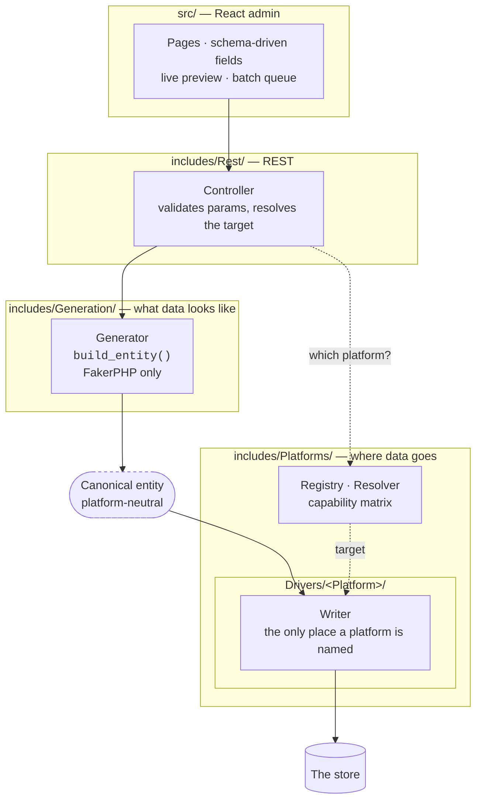
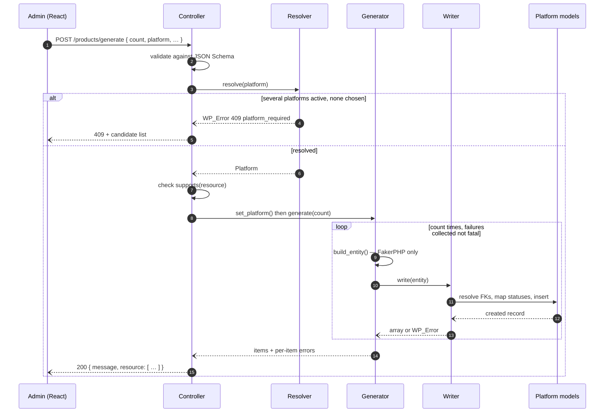
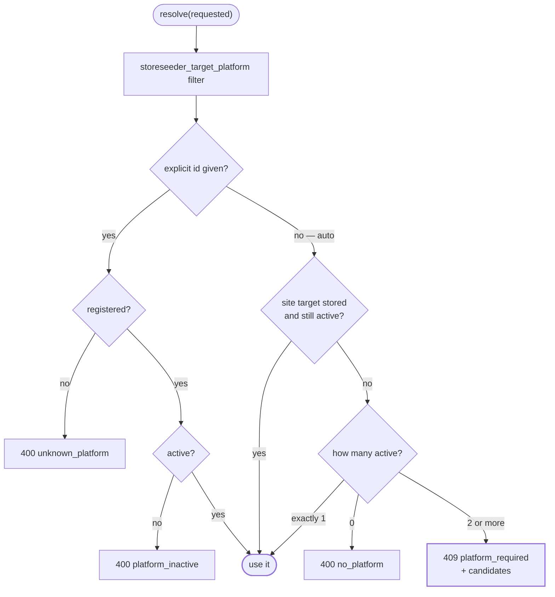
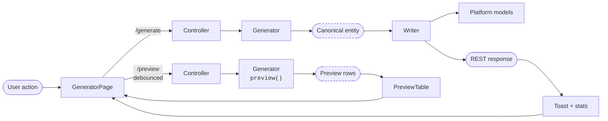

# Architecture Documentation

Welcome to the comprehensive architecture guide for StoreSeeder. This document provides detailed insights into the plugin's modern, enterprise-grade architecture designed for scalability, maintainability, and developer experience.

## 🏗️ Modern Plugin Structure

StoreSeeder follows a clean, modular architecture that separates concerns while maintaining tight integration with WordPress standards and a driver layer for each supported e-commerce platform.

```
storeseeder/
├── storeseeder.php              # Plugin header, constants, bootstrap
├── class-storeseeder.php        # Singleton orchestrator: menu, assets, REST wiring
├── includes/                    # PHP backend. PSR-4: StoreSeeder\ → includes/
│   ├── Access.php               # One capability gate for menu, REST, MCP and AJAX
│   ├── Generation/              # What data looks like — no platform knowledge
│   │   ├── Generator.php        #   abstract base: FakerPHP, batching, preview, logging
│   │   ├── Ledger.php           #   records what was created, so it can be deleted later
│   │   ├── Purge.php            #   deletes it, through the writer that created it
│   │   └── Generators/          #   18 concrete generators, one per resource
│   ├── Rest/                    # REST surface
│   │   ├── Controller.php       #   abstract base: params, validation, platform resolution
│   │   ├── Registry.php         #   owns storeseeder_rest_controllers
│   │   └── Controllers/         #   18 controllers, one per resource
│   ├── CLI/                     # WP-CLI surface (only registers when WP_CLI is present)
│   │   ├── Command.php          #   abstract base: resource resolution, payload building
│   │   ├── Registry.php         #   owns storeseeder_cli_commands
│   │   └── Commands/            #   generate, preview, platforms, locales, sample-data, cleanup
│   ├── MCP/                     # Model Context Protocol integration (optional)
│   │   ├── MCP_Server.php       #   server + category registration
│   │   ├── Registry.php         #   owns storeseeder_mcp_abilities
│   │   ├── Settings.php         #   the three switches: AI surface, preview, generate
│   │   ├── Ability.php          #   abstract base: dispatches through the REST API
│   │   └── Abilities/           #   17 self-describing abilities, one per resource
│   └── Platforms/               # Where data goes
│       ├── Platform_Interface.php  # what a platform must answer
│       ├── Platform_Driver.php     # abstract base for shipped drivers
│       ├── Writer.php              # abstract base: persists one resource
│       ├── Registry.php            # holds drivers; owns storeseeder_platforms
│       ├── Resolver.php            # auto | explicit → one target platform
│       ├── Capability.php          # can this platform do this, and why not
│       ├── Resource.php            # the 18 canonical resource names
│       ├── Status.php              # canonical status vocabulary
│       ├── Locale.php              # the 75 generatable locales; owns storeseeder_locales
│       └── Drivers/
│           └── Fluent_Cart/
│               ├── Platform.php    # capability matrix + writer map
│               └── Writers/        # 18 writers, one per resource
├── src/                         # React admin (TypeScript)
│   ├── index.tsx                # entry point, mounts into #storeseeder-root
│   ├── components/              # App.tsx, Pages/, shell/, generator/, home/,
│   │                            #   dashboard/, overlays/, ui/
│   ├── lib/                     # generators.ts, platform.ts, fieldsFromSchema.ts, …
│   ├── providers/               # Stats, Toast, Batch, Platform contexts
│   ├── theme/  types/           # theme provider, shared TypeScript types
│   └── styles.css  components.css
├── build/                       # Compiled assets — the only JS shipped
├── tests/
│   ├── php/                     # PHPUnit, mirroring the includes/ layout
│   └── e2e/                     # Playwright specs
├── docs/                        # Documentation
├── composer.json  package.json  # Dependencies and scripts
├── webpack.config.js  tsconfig.json  postcss.config.js  tailwind.config.js
└── phpcs.xml  phpstan.neon  phpunit.xml.dist
```

### Directory structure explanation

The layout states the class hierarchy: each abstract sits at the root of the scope it
governs, and its concrete children nest one level beneath it.

- **`includes/Generation/`** — shapes data. A generator names no platform: no models, no
  table names, no platform status strings, no database reads. That restriction is what lets
  one generator feed every platform, and lets a fixed seed produce the same data on all of
  them. `Ledger` and `Purge` sit here rather than in the platform layer because remembering
  *that* a row was created is platform-neutral bookkeeping; removing it is the writer's job.
- **`includes/Platforms/`** — persists data. Writers are the only place a platform's models,
  tables and status spellings appear. Drivers register through the
  `storeseeder_platforms` filter, so a platform can be added from a separate plugin.
- **`includes/Rest/`** — the REST surface, and where the target platform is resolved
  for a request.
- **`includes/MCP/`** — optional AI tooling; abilities dispatch through the REST API rather
  than calling generators directly.
- **`includes/CLI/`** — the WP-CLI surface, dispatching through the REST API for the same
  reason: three entry points, one set of rules about what a parameter means. The registry is
  usable without the WP-CLI runtime present, which is what lets the command logic be tested
  under PHPUnit.
- **`src/`** — the React admin.
- **`build/`** — compiled assets; the source in `src/` is not shipped in the plugin package.

### The layers, and where platform knowledge is allowed



Read the diagram as a rule, not a picture: everything above the canonical entity is
platform-neutral, everything that names a platform is inside a driver, and nothing crosses that
line in either direction.

## 🔗 The platform layer

StoreSeeder used to be a Fluent Cart plugin. It is now platform-agnostic above the driver
line, and Fluent Cart is one driver.

### A request, end to end



The preview path branches off before the resolver is ever consulted — `preview()` builds rows
from `build_entity()` and returns them, so previewing works with no platform chosen and writes
nothing.

### What a driver is

A driver answers four questions, through `Platforms\Platform_Interface`:

| Question | Method |
|---|---|
| What are you called? | `id()`, `label()` |
| Are you installed right now? | `is_active()`, `version()` |
| What can you generate, and why not? | `supports()` |
| How do you persist resource X? | `writer( $resource_type )` |

Extending `Platforms\Platform_Driver` supplies the repetitive parts — lazily building
writers, normalising the capability matrix, and applying the two per-driver filters.

### Where platform knowledge is allowed

Exactly one place: a **writer**. Models, table names, column names and status spellings appear
inside `Platforms/Drivers/<Platform>/Writers/` and nowhere else.

A generator produces a *canonical entity* and must name no platform — no models, no table
names, no platform status strings, no database reads. That restriction is what lets one
generator feed every platform, and lets a fixed seed produce identical data on all of them.

Two conventions carry every platform without special-casing:

- **Money is an integer in the currency's minor unit**, with an explicit currency. Never a
  float: binary rounding on a price is a real bug and an invisible one. Fluent Cart stores
  cents so its writers pass the value through; platforms that store decimals divide.
- **Statuses use the canonical vocabulary** in `Platforms/Status.php`, mapped per writer. The
  canonical names are deliberately no single platform's spelling — WooCommerce needs a `wc-`
  prefix, Fluent Cart does not.

### What a writer legitimately does beyond writing

Reads. The split is not "invented data vs. saved data" but "data with no platform in it vs.
everything touching the platform, in either direction".

Several resources cannot be shaped without reading real rows: an order needs real product
variations to have line items and their real prices to have a total; a refund needs an existing
charge transaction; a label needs orders to attach to. Resolving those foreign keys is the
writer's job, because each platform stores and randomises them differently. Uniqueness works
the same way — a generator proposes an SKU, and the platform that owns the unique index checks
it and re-rolls.

What a writer must never do is invent a name, address, date or quantity. Those arrive on the
entity, already localised by FakerPHP.

### Extensions are reported, not inferred

`Platform_Driver::extensions()` lists what a site has installed beside the platform —
`[{ slug, label, active, version }]`. It answers a different question from the capability
matrix: "Fluent Cart 1.6.0, Pro 1.5.3" is a fact, "licences unavailable" is a consequence of
it, and a support conversation starts with the first. Empty by default, so a driver with no
add-ons says nothing rather than inventing a shape.

It lives on `Platform_Driver` rather than `Platform_Interface`, deliberately: adding a method
to the interface would break every third-party driver that implements it directly, which is a
documented extension point. Callers use it through `instanceof Platform_Driver`.

Fluent Cart reports Fluent Cart Pro, and gates the licence resource on it. WooCommerce will
report WooCommerce Subscriptions the same way.

### Capabilities are computed, never cached

`supports()` runs per request. Support is conditional: WooCommerce core has no subscriptions
until WooCommerce Subscriptions is active, and StoreEngine gates several resources behind its
own addons. Caching the matrix in an option would mean activating a companion plugin failed to
register.

A bare boolean would be enough to disable a generator but not to explain it, so each
unsupported resource carries a reason and, where one applies, the slug of the plugin that would
enable it. The admin says "Requires WooCommerce Subscriptions" instead of dimming a tile in
silence, and the REST API answers 400 rather than writing nothing and reporting success.

### Choosing the target

`Platforms\Resolver` turns a request into one platform, or into an error explaining why it
cannot:




| Situation | Result |
|---|---|
| Explicit platform id, registered and active | that platform |
| Explicit id, unknown or inactive | `400` |
| Auto, and a site-wide target is stored and still active | the stored platform |
| Auto, exactly one platform active | that platform |
| Auto, several active and none chosen | `409 storeseeder_platform_required`, listing candidates |
| Auto, none active | `400` |

Guessing is not an option: picking the wrong target writes rows into the wrong store, and
nothing about that failure is visible afterwards. A stored target that has since been
deactivated falls through to auto rather than erroring, so deactivating a plugin cannot leave
the admin stuck behind an error it has no way to clear.

The target is a site option, not a browser preference, so two administrators cannot
unknowingly seed different platforms.

## 🎨 Design patterns in use

### Abstract base classes

#### `Generation\Generator`

```php
abstract class Generator {
    // The only method a generator must implement. FakerPHP and loaded sample
    // data only -- see "Where platform knowledge is allowed" above.
    abstract protected function build_entity();

    abstract protected function get_resource_type(): string;
    abstract public function get_supported_types(): array;
    abstract public function get_description(): string;
}
```

`generate( int $count )` is a template method and is not overridden. It validates the count,
filters the parameters, seeds the faker, then loops: build an entity, filter it, hand it to the
target platform's writer, and collect per-item failures without aborting the batch.
`generate_single_item()` is `final` precisely so a generator cannot reach a platform even by
accident.

`preview( int $count )` builds rows from `build_entity()` and writes nothing, which is what
makes it safe to call on every keystroke in the admin.

#### `Rest\Controller`

```php
abstract class Controller extends WP_REST_Controller {
    abstract protected function get_rest_base(): string;
    abstract protected function get_generator_instance(): Generator;
    abstract protected function get_resource_type(): string;
    abstract protected function get_resource_type_label(): string;
}
```

Each controller registers exactly two routes — `POST /<base>/generate` and
`POST /<base>/preview` — and resolves the target platform for the request before handing it to
the generator. Both callbacks return `WP_REST_Response|WP_Error`.

#### `Platforms\Writer`

```php
abstract class Writer {
    abstract public function resource(): string;
    abstract public function write( array $entity );   // array|WP_Error
}
```

Returning `array|WP_Error` rather than an id is deliberate: it is the contract
`generate()` already loops over, so a per-item failure lands in the batch's error list instead
of aborting the run. It also leaves room for a driver whose write is a remote HTTP call.

### Extension points

Every seam is a filter, so a platform can be added from a separate plugin without patching
this one.

Two site options sit behind the filters: `storeseeder_target_platform` (the chosen driver)
and `storeseeder_allowed_roles` (roles granted access from Settings, never including
administrator). Both are written through REST rather than read from the admin directly.

| Hook | Kind | Purpose |
|---|---|---|
| `storeseeder_platforms` | filter | Register a driver. The whole surface needed to add a platform. |
| `storeseeder_rest_controllers` | filter | Add or remove a REST controller, so a driver can expose a resource of its own |
| `storeseeder_capability` | filter | The capability required to use StoreSeeder. Governs the admin menu, every REST route, every MCP ability and the AJAX handlers together, so access cannot be widened for one and not the others. An unusable return falls back to `manage_options` |
| `storeseeder_mcp_abilities` | filter | Add or remove an MCP ability |
| `storeseeder_purge_order` | filter | The order generated resources are deleted in when clearing test data. Children must come before their parents; entries that name no known resource are dropped and anything omitted is appended, so nothing becomes undeletable by a careless filter |
| `storeseeder_mcp_settings` | filter | Decide the three MCP switches — the AI surface, the preview tools, the generate tools — in code. Every gate reads through it, so `false` withdraws those tools wherever they are registered. A dropped key reads as off rather than as null |
| `storeseeder_cli_commands` | filter | Add or remove a `wp storeseeder` subcommand |
| `storeseeder_{resource}_generation_result` | filter | Inspect or reshape what one write reports — `storeseeder_product_generation_result` and so on, for all eighteen. The name is derived from the writer's resource by `Writer::filter_result()`, so it cannot drift from it |
| `storeseeder_shipping_method_generation_result` | filter | **Deprecated in 1.1.0.** The shipping-plan writer's old hook, kept firing after the correctly named one so existing callbacks keep working. Use `storeseeder_shipping_plan_generation_result` |
| `storeseeder_customer_data_before_create` | filter | The customer entity immediately before the write. Predates `storeseeder_canonical_entity`, which does the same job for every resource and is the one to reach for |
| `storeseeder_after_customer_created` | action | Fires after a customer row exists. Resource-specific, for the same historical reason; `storeseeder_after_write_{platform}_{resource}` covers all of them |
| `storeseeder_hide_foreign_admin_notices` | filter | Return false to let other plugins' admin notices show on StoreSeeder's screen |
| `storeseeder_menu_icon_variant` | filter | Which icon variant the admin menu uses |
| `storeseeder_set_postname_permalinks` | filter | Return false to stop activation switching the site to post-name permalinks |
| `storeseeder_rest_message` | filter | The message a generate response carries |
| `storeseeder_rest_response` | filter | The whole generate response, last of all |
| `storeseeder_platform_writers_{id}` | filter | Replace or add a writer for one driver |
| `storeseeder_platform_supports_{id}` | filter | Override the capability matrix; also how an extension declares it satisfies a requirement |
| `storeseeder_canonical_entity` | filter | Mutate every neutral entity, whatever its resource. Runs before the per-resource filter, which therefore wins |
| `storeseeder_canonical_{resource}` | filter | Mutate the neutral entity before it is written — applies to every platform equally |
| `storeseeder_target_platform` | filter | Force the target, overriding request and stored option |
| `storeseeder_locales` | filter | Narrow or extend the generatable locales. The admin picker, REST enum and MCP schema all read it, so they cannot disagree. An empty or malformed return is discarded rather than leaving nothing selectable |
| `storeseeder_locale` | filter | Force the generation locale, overriding request and site locale |
| `storeseeder_before_write_{platform}_{resource}` | action | |
| `storeseeder_after_write_{platform}_{resource}` | action | Fires for failures too, so a listener sees the whole batch |
| `storeseeder_generation_params_{type}` | filter | Adjust parameters before a run |
| `storeseeder_generated_item_{type}` | filter | Inspect or modify each produced item |
| `storeseeder_before_generate_single_item_{type}` | action | |
| `storeseeder_after_generate_single_item_{type}` | action | |
| `storeseeder_after_batch_generate_{type}` | action | Cache clearing, index updates |
| `storeseeder_rest_params` | filter | Alter the parameter schema of every generation endpoint; receives the REST base as its second argument. Runs before the per-endpoint filter |
| `storeseeder_rest_params_{base}` | filter | Alter one endpoint's parameter schema |
| `storeseeder_mcp_ability_definition` | filter | Amend one ability's definition — label, description, input schema, callbacks — without replacing the class |
| `storeseeder_admin_payload` | filter | Add to the data inlined as `window.storeseederApi`, so a driver's own configuration is there on first paint |
| `storeseeder_sample_data_source` | filter | Where sample data is downloaded from. Change `repo_url` and `zip_url` together: the first is what the consent prompt shows |
| `storeseeder_rest_message` / `storeseeder_rest_response` | filter | Shape the REST response |
| `storeseeder_{resource}_generation_result` | filter | Per-resource result payload |

## ⚛️ Frontend architecture

React 18 with React Router v7, entered at `src/index.tsx` and compiled to a single bundle at
`build/admin-app.js`.

### Routing

`createHashRouter`, because the admin lives at one WordPress page and hash routes need no
rewrite rules:

```tsx
const router = createHashRouter([
  {
    path: '/',
    element: <RootLayout />,
    children: [
      { index: true,             element: <HomePage />      },
      { path: 'generator/:type', element: <GeneratorPage /> },
      { path: 'settings',        element: <SettingsPage />  },
      { path: 'plugins',         element: <PluginsPage />   },
    ],
  },
]);
```

Every generator shares the one dynamic `generator/:type` route, matched against `route` in
`src/lib/generators.ts`. There are no route loaders and no code splitting; the bundle is a
single file.

### Component architecture

#### Page components (`src/components/Pages/`)

- **`RootLayout.tsx`** — application wrapper, WordPress admin integration
- **`HomePage.tsx`** — stat cards, recent activity, generator grid
- **`GeneratorPage.tsx`** — config column, live preview, run bar
- **`SettingsPage.tsx`** — generation defaults, run history, sample data, about, danger zone
- **`PluginsPage.tsx`** — the author's other plugins

#### Generator components (`src/components/generator/`)

- **`ConfigColumn.tsx`** — header, dependency notes, the target-platform prompt, and the field
  sections derived from the generator's parameter schema
- **`FieldSection.tsx`** and **`fields/`** — schema-driven controls: `Chips`, `FieldSelect`,
  `NumberField`, `RangeField`, `Stepper`, `TextField`, `Toggle`
- **`PreviewTable.tsx`** — debounced, read-only rows from the `/preview` route
- **`RunBar.tsx`** — count, seed, metadata toggle, and the two actions

There is no shared generator component. Every generator renders from its parameter schema
through `src/lib/fieldsFromSchema.ts`, so adding one needs no new React.

#### Data flow



The preview path is separate and never reaches a writer, which is why previewing works even
when no target platform has been chosen.

### State management

React context, four providers, no external state library:

- **`StatsProvider`** — run counts and recent activity, persisted to `localStorage`
- **`ToastProvider`** — transient notifications
- **`BatchProvider`** — the queue behind "Add to batch"; runs items sequentially in the browser
- **`PlatformProvider`** — the active platforms, the resolved target, and the capability matrix,
  seeded from a payload the server inlines so the topbar never renders a target it then
  corrects

### Styling

Tailwind CSS v4, plus `src/components.css` for component styles that outgrow utilities — plain
CSS scoped under `.fp-root`.

The admin picks up the user's WordPress colour scheme. `class-storeseeder.php` inlines four
custom properties, which Tailwind consumes as theme colours:

```css
:root {
  --wp-admin-primary:   /* from the user's scheme */;
  --wp-admin-secondary: /* … */;
  --wp-admin-highlight: /* … */;
  --wp-admin-accent:    /* … */;
}
```

## ⚡ Scale and limits

Being straight about this matters more than describing an optimisation strategy the plugin does
not have.

- **A run is capped at 100 items** (`$max_batch_size`, enforced by `validate_count()` and by
  the REST schema). Larger datasets come from repeated runs, or from queueing several through
  the batch tray.
- **The batch queue is client-side.** It posts each item in turn from the browser. There is no
  cron, no background worker, and no server-side async.
- **Writes are per item.** No bulk inserts, no transactions, no chunking, no resume. A failed
  item is recorded in the batch's error list and the run continues; a batch where nothing
  succeeded returns `500` with the first reason rather than `200` and "0 items created".
- **Nothing is cached.** No object cache, no transients. The capability matrix is deliberately
  recomputed per request, as above.
- **No raw SQL.** Every write goes through the platform's own models, so validation,
  relationships and money handling match what the platform would do itself. There is no
  `$wpdb` usage in `includes/`.

Memory is the practical ceiling on a single run, and 100 items is comfortably inside it on
default PHP settings.
