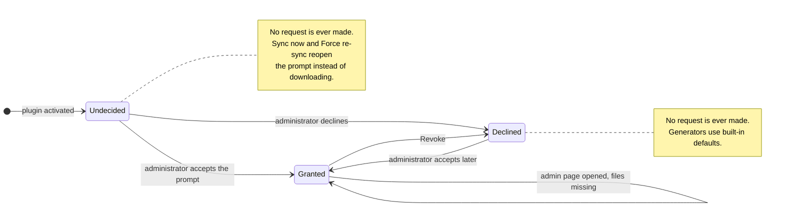

# External Services

StoreSeeder connects to two external services. Neither is contacted on activation, both are
administrator-initiated, and no personal or store data is ever transmitted to either one.

This page is the full disclosure required by the
[WordPress.org plugin guidelines](https://developer.wordpress.org/plugins/wordpress-org/detailed-plugin-guidelines/);
[`readme.txt`](../readme.txt) links here from its `External services` section.

## Summary

| Service | Purpose | Triggered by | Optional |
|---------|---------|--------------|----------|
| [GitHub](#1-github--sample-data-repository) | Download locale sample data | Administrator accepting the consent prompt | Yes — generators fall back to built-in defaults |
| [WordPress.org](#2-wordpressorg--plugin-directory-api) | List the author's other plugins | Administrator opening the **Our Plugins** page | Yes — the page is informational only |

## 1. GitHub — sample data repository

Sample data is locale-specific reference data (product names, addresses, customer tags) used to make
generated content more realistic. It is downloaded **only after an administrator accepts the consent
prompt** shown on the plugin admin page. That prompt is the only thing that grants permission; no
other control does.

Declining costs you nothing functionally: every generator keeps working from built-in defaults. The
decision is site-wide and can be changed from Settings at any time. **Revoke** withdraws permission.
While permission is not granted, **Sync now** reopens the consent prompt rather than downloading, so
the question always sits on the action that needs it — no download can start without an explicit
approval in that prompt. The prompt appears on its own only on a site that has not decided yet and
has no sample data.

| | |
|---|---|
| **Service** | GitHub |
| **Endpoint** | `https://github.com/mralaminahamed/storeseeder-sample-data-fluent-cart/archive/refs/heads/trunk.zip` |
| **When the request happens** | Only after an administrator has accepted the consent prompt on the plugin admin page. Three cases: the prompt's own approval button; **Sync now** / **Force re-sync** in Settings once permission is on record; and opening the plugin admin page when permission is already granted but the extracted files are missing, which re-downloads them silently. Never before permission is granted, never on activation, and never on a schedule. |
| **Made by** | The site's PHP process, via the WordPress HTTP API |
| **Data sent** | An unauthenticated HTTP `GET`. No site, user, or store data is included — only the request itself, plus the IP address and user agent inherent to any HTTP request. |
| **Data received** | A ZIP archive of JSON reference files, extracted into `wp-content/uploads/storeseeder-sample-data-fluent-cart/` |
| **Terms of Service** | https://docs.github.com/en/site-policy/github-terms/github-terms-of-service |
| **Privacy Policy** | https://docs.github.com/en/site-policy/privacy-policies/github-general-privacy-statement |

The three states a site can be in, and every transition that can cause a request:

Only the `Granted` state can produce an outbound request, and every arrow into it is an explicit
administrator action. Nothing here is triggered by activation, by a schedule, or by generating
data.

The downloaded archive is validated before extraction: entry paths are checked so that no file can be
written outside the target directory (zip-slip / path traversal). See [`SECURITY.md`](../SECURITY.md).

Source repository for the data itself:
[mralaminahamed/storeseeder-sample-data-fluent-cart](https://github.com/mralaminahamed/storeseeder-sample-data-fluent-cart).

## 2. WordPress.org — plugin directory API

The **Our Plugins** admin page lists the plugin author's other WordPress.org plugins with live
ratings and install counts. It is purely informational — nothing on that page affects generation.

| | |
|---|---|
| **Service** | WordPress.org Plugin Directory API |
| **Endpoint** | `https://api.wordpress.org/plugins/info/1.2/` |
| **When the request happens** | Only when an administrator opens the **Our Plugins** page in the plugin admin |
| **Made by** | The administrator's browser (`fetch` from the admin app) |
| **Data sent** | A query for plugins by the author `mralaminahamed`. No site, user, or store data is included — only the request itself, plus the IP address and user agent inherent to any HTTP request. |
| **Data received** | Public plugin directory metadata: names, slugs, ratings, install counts, icons |
| **Terms of Service** | https://wordpress.org/about/ |
| **Privacy Policy** | https://wordpress.org/about/privacy/ |

## What StoreSeeder does not do

- **No analytics, telemetry, or phoning home.** There is no usage reporting of any kind.
- **No outbound traffic during generation.** Generated data is written to your own database and stays
  there.
- **No third-party assets at runtime.** Fonts, icons, scripts, and styles are all bundled; the admin
  app loads nothing from a CDN.
- **No account or licence checks.** The plugin has no server-side component.

Generated content is fictional and does not represent real individuals or transactions.

## Related

- [`readme.txt`](../readme.txt) — WordPress.org plugin directory metadata
- [`SECURITY.md`](../SECURITY.md) — vulnerability reporting and the plugin's security measures
- [Usage](usage.md) — the Settings page, including the sample data consent control
- [Architecture](architecture.md) — where the sample data loader sits in the generation flow
