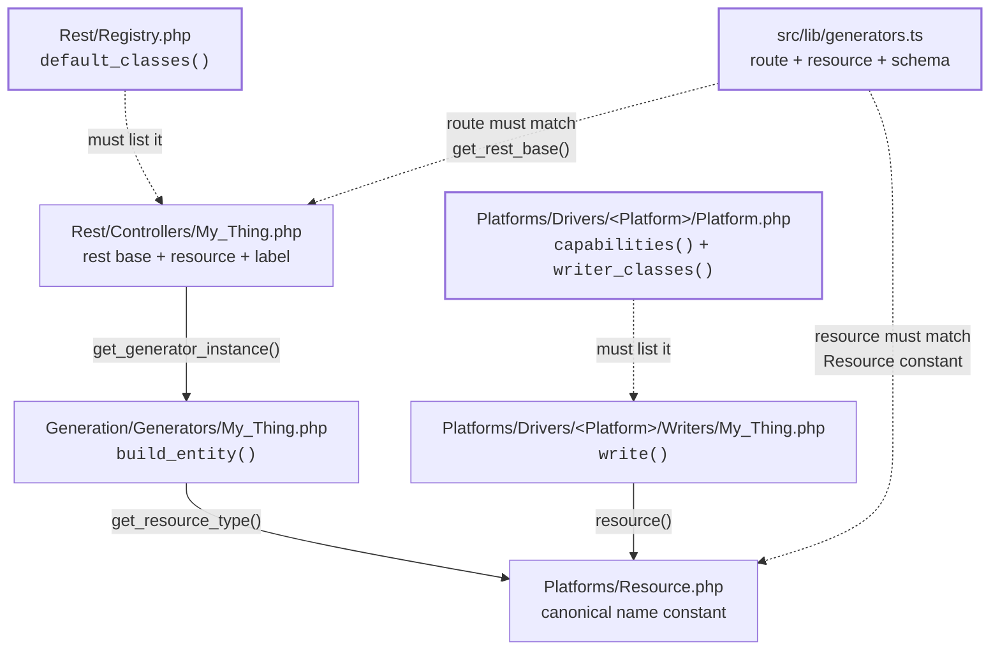
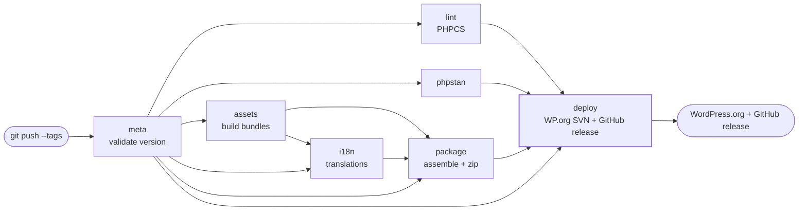

# 🛠️ Development Guide

How to work on StoreSeeder. Commands here are the ones that exist in `composer.json` and
`package.json`; see [`CLAUDE.md`](../CLAUDE.md) for the invariants and traps, and
[`AGENTS.md`](../AGENTS.md) for coding style.

## 🚀 Setup

### Prerequisites

- **PHP** 7.4+ (8.0+ recommended). 7.4 is a hard floor — no union return types, `match`,
  enums, constructor promotion or `readonly`.
- **Node.js** 20+ (`@wordpress/scripts` v30 requires it; CI runs 22–24)
- **Composer** 2.0+
- **Yarn** — the repo is yarn-managed (`packageManager: yarn@4`, only `yarn.lock` is
  committed). Do not use npm.
- **WordPress** 6.5+, with at least one supported e-commerce platform active
- **MySQL** for the PHPUnit suite

### Setup

```bash
git clone https://github.com/mralaminahamed/storeseeder.git
cd storeseeder
composer install && yarn install && yarn build
```

`build/` is not committed, so `yarn build` is required before the admin page renders anything.

## 🏗️ Commands

### Frontend

```bash
yarn start                  # webpack watch
yarn build                  # production bundle -> build/admin-app.js
yarn lint:js                # ESLint (flat config)
yarn lint:js:fix
yarn test:unit              # Jest unit tests
yarn test:unit:watch
yarn test:unit:coverage
yarn packages-update        # update @wordpress/* packages
npx tsc --noEmit            # not wired to a script, still catches real errors
```

### TypeScript unit tests

Jest, configured by `jest.config.js`, with tests **beside the code they test**:

```
src/lib/locales.ts
src/lib/locales.test.ts
```

That is a deliberate choice over a parallel `tests/` tree. A module and its tests move,
rename and get reviewed together, and a module with no test is visible by the absence of a
neighbour rather than by comparing two directory listings.

Component tests use React Testing Library in the same files (`src/components/**/X.test.tsx`)
and query by role and accessible name rather than by class — which is how the Toggle tests
assert that its caption is part of the control's accessible name, something a class-based
query cannot see.

Four things worth knowing before adding one:

- **Naming decides the runner.** Jest collects `*.test.ts(x)`; Playwright collects
  `*.spec.ts`. Cross them and each tries to execute the other's files — a Playwright spec
  under Jest fails with a confusing error about `test.describe`.
- **TypeScript runs through Babel, not ts-jest.** `@wordpress/babel-preset-default` already
  carries `@babel/preset-typescript`, so types are *erased*, not checked. `npx tsc --noEmit`
  covers `src/` including the tests, and is the only type-check they get. ts-jest would
  check the same files a second time, more slowly, for no extra signal.
- **Import from `@jest/globals`** (`import { describe, it, expect } from "@jest/globals"`)
  rather than relying on ambient globals. That is what lets the tests type-check without an
  `@types/jest` dependency.
- **DOM matchers come from `@testing-library/jest-dom/jest-globals`**, not the bare package.
  The bare entry augments the ambient `jest.Matchers` only, so `toBeInTheDocument` would work
  at runtime and fail `tsc --noEmit`.

No CSS mapping in `jest.config.js`: stylesheets are imported once by `src/index.tsx` and by
nothing else, so no module under test ever pulls one in. If a future test does import a
stylesheet, Jest fails loudly with "Cannot find module" and the fix is a `moduleNameMapper`
entry pointing `\\.(css|scss)$` at a stub that exports an empty object.

`jest.setup.ts` — at the repository root, beside the config that loads it, since it is
harness rather than a module the admin app could import — also calls RTL's `cleanup()` after each test — React 18 leaves mounted
trees in place otherwise, so a query in one test can match an element the previous test
rendered. It runs before every file and resets the two browser globals the modules
read — `window.storeseederApi`, which the server inlines in production, and `localStorage` —
so one test cannot leak state into the next. That is the failure mode that makes a suite pass
in one order and fail in another.

### PHP

```bash
composer phpcs              # WPCS. Scans includes/ only
composer phpcbf             # autofix
composer phpstan            # level 7, over includes/ + class-storeseeder.php
composer phpcs:plugin-review # the stricter WordPress.org submission ruleset
composer test               # PHPUnit — needs environment, see below
composer test:coverage
composer makepot            # requires build/admin-app.js to exist first
composer release            # lint, analyse, build, makepot, prod install, zip
composer zip:dev            # unoptimised zip for testing
```

Aliases exist for muscle memory: `lint` → `phpcs`, `format`/`fix` → `phpcbf`,
`analyse` → `phpstan`.

### Running the PHP suite

`composer test` alone fails with a database error. It needs a dedicated database and three
environment variables:

```bash
mysql -uroot -p -e "CREATE DATABASE IF NOT EXISTS wordpress_test;"
export WP_PHPUNIT__DIR="$PWD/vendor/wp-phpunit/wp-phpunit" \
       WP_DB_PASS=your-mysql-password \
       WP_PATH=/path/to/wordpress
composer test
```

`phpunit.xml.dist` declares an empty `WP_DB_PASS`, which is correct for CI and usually wrong
locally. PHPUnit does not override an already-exported variable, so exporting wins.

The suite loads real platform plugins from directories beside the plugin, and only those
StoreSeeder ships a driver for. Tests needing an absent platform skip through
`require_platform( $id )` rather than failing, so the suite runs with only the platforms you
happen to have.

**The suite is currently 401 tests / 2195 assertions, alongside 215 Jest tests.** For a change that claims no behaviour
difference, that number must come back identical, not merely green — a changed count means a
reference was missed.

### End-to-end

```bash
yarn test:e2e               # Playwright
yarn test:e2e:ui            # interactive
yarn test:e2e:report
yarn shots:wporg            # regenerates .wordpress-org screenshots
yarn shots:banners          # regenerates .wordpress-org banners
yarn shots:docs             # regenerates the documentation site's screenshots
yarn shots:docs-banner      # regenerates the documentation site's hero banner
```

> [!WARNING]
> `yarn test:e2e:setup` runs `tests/e2e/setup.sh`, which **resets the admin password** of the
> target site. Only point it at a throwaway install.

The screenshot and banner specs are excluded from the default Playwright project so ordinary
runs cannot overwrite the shipped WordPress.org images; they run through
`playwright.wporg-shots.config.ts`.

## 📋 Coding standards

Full rules in [`AGENTS.md`](../AGENTS.md). The ones people get wrong:

- **PHP indents with tabs**, per WPCS, even though `.editorconfig` says spaces. TypeScript
  indents with 2 spaces.
- **PHP methods and variables are `snake_case`**; classes and filenames are PascalCase with
  underscores (`Order_Tax_Rate.php`).
- `$resource` is rejected by WPCS as a reserved name — use `$resource_type`.
- Every user-facing string goes through `@wordpress/i18n` or `__()`, with a
  `/* translators: */` comment for each placeholder.
- Font weights are round hundreds only: 400, 500, 600, 700.

## 🔧 Adding a generator

A resource needs six pieces. Copy the closest existing set rather than starting blank.

What trips people is not writing the two classes — it is the four places that have to *know*
about them. Solid arrows are "references"; dashed are the registration edits that are easy to
forget:



The three bold boxes are registries. Miss the driver one and the run fails with
`storeseeder_missing_writer`; miss the REST registry and the routes never appear; miss the
TypeScript one and the generator exists but is invisible in the admin.


### 1. The generator — shapes data, names no platform

`includes/Generation/Generators/My_Thing.php`

```php
<?php

namespace StoreSeeder\Generation\Generators;

use StoreSeeder\Generation\Generator;

defined( 'ABSPATH' ) || exit;

class My_Thing extends Generator {

    protected function get_resource_type(): string {
        return 'my_thing';
    }

    public function get_supported_types(): array {
        return array( 'my_things' => __( 'My Things', 'storeseeder' ) );
    }

    public function get_description(): string {
        return 'Generates my things for testing.';
    }

    /**
     * FakerPHP and loaded sample data only. No models, no table names, no
     * platform status strings, no database reads.
     *
     * @return array<string, mixed>
     */
    protected function build_entity() {
        return array(
            'title'  => $this->get_faker()->sentence( 3 ),
            // Integer minor units. Never a float.
            'amount' => (int) round( $this->get_faker()->randomFloat( 2, 5, 500 ) * 100 ),
        );
    }
}
```

`generate()` and `generate_single_item()` are not overridable — the latter is `final`, so a
generator cannot reach a platform even by accident.

### 2. The writer — persists it, for one platform

`includes/Platforms/Drivers/Fluent_Cart/Writers/My_Thing.php`

```php
<?php

namespace StoreSeeder\Platforms\Drivers\Fluent_Cart\Writers;

use StoreSeeder\Platforms\Resource;
use StoreSeeder\Platforms\Writer;
use WP_Error;

defined( 'ABSPATH' ) || exit;

final class My_Thing extends Writer {

    public function resource(): string {
        return Resource::MY_THING;
    }

    /**
     * @param array<string, mixed> $entity Canonical entity.
     *
     * @return array<string, mixed>|WP_Error
     */
    public function write( array $entity ) {
        // Resolve foreign keys and check uniqueness here -- only the platform
        // knows what already exists.
        return array( 'id' => 1, 'title' => $entity['title'] );
    }
}
```

### 3. Register it on the driver

Add the resource to `capabilities()` and the class to `writer_classes()` in
`includes/Platforms/Drivers/Fluent_Cart/Platform.php`. A driver that claims a resource but
ships no writer is reported as `storeseeder_missing_writer` rather than failing per item.

### 4. The canonical name

Add a constant to `includes/Platforms/Resource.php` and include it in `all()`.

### 5. The controller and the admin entry

`includes/Rest/Controllers/My_Thing.php`:

```php
<?php

namespace StoreSeeder\Rest\Controllers;

use StoreSeeder\Rest\Controller;
use StoreSeeder\Generation\Generator;
use StoreSeeder\Generation\Generators\My_Thing as My_Thing_Generator;

defined( 'ABSPATH' ) || exit;

class My_Thing extends Controller {

    protected function get_rest_base(): string {
        return 'my_things';
    }

    protected function get_resource_type(): string {
        return 'my_thing';
    }

    protected function get_resource_type_label(): string {
        return __( 'My Thing', 'storeseeder' );
    }

    protected function get_generator_instance(): Generator {
        return new My_Thing_Generator();
    }
}
```

Then list it in `Rest\Registry::default_classes()` — or add it from your own plugin through the
`storeseeder_rest_controllers` filter, which is how a platform driver ships a resource of its
own. Finally add an entry to
`src/lib/generators.ts` with `route` (the REST base), `resource` (the canonical name), an icon
from `src/lib/icons.tsx`, and the parameter schema.

**No React is needed.** Fields render from the parameter schema through
`src/lib/fieldsFromSchema.ts`.

### Optional: a parameter only your platform has

`Platform_Driver::fields( $resource )` returns JSON Schema fragments keyed by parameter name, and
your writer reads them from `$this->params`:

```php
protected function platform_fields( string $resource_type ): array {
    if ( Resource::PRODUCT !== $resource_type ) {
        return array();
    }

    return array(
        'tax_status' => array(
            'description' => __( 'WooCommerce only. Whether products are taxable.', 'storeseeder' ),
            'type'        => 'string',
            'enum'        => array( 'taxable', 'shipping', 'none' ),
            'default'     => 'taxable',
        ),
    );
}
```

Three rules. **Name the platform in the description** — the endpoint accepts every driver's fields,
so the reader needs to know whose is whose. **Validate in the writer too**, because a writer can be
driven from WP-CLI, an MCP tool or a test, none of which pass through the REST schema. And **never
declare a field the writer does not read**: that is exactly the `include_images` bug this seam was
built to stop repeating.

If your platform stores a resource but not all of a canonical entity's fields, say so with
`Capability::supported_except( array( 'with_account' ) )` rather than dropping them in the writer.
The admin prints the list, and the REST response reports it.

### Make it deletable

A writer inherits `delete( $id )` from `Platforms\Writer`, and the inherited version refuses —
so a new resource is generated and reported, but the cleanup says it cannot be removed
automatically. Override it, and use `delete_model()` for the common shape:

```php
public function delete( $id ) {
    return $this->delete_model(
        OrderModel::class,
        $id,
        array( OrderItemModel::class => 'order_id' )   // children first; none of them cascade
    );
}
```

Two things to get right. **The id must be the one `write()` reported** — the cleanup passes back
whatever went into `$result['id']`, which for a Fluent Cart cart session is a hash rather than
an integer, so pass the key column as `delete_model()`'s fourth argument where it is not `id`.
And **only delete what the writer created**: a row it merely reused — the WordPress user a
customer was linked to, a shipping zone an existing method already used — belongs to the store.

If the resource has to be deleted before or after another, say so with `storeseeder_purge_order`
rather than relying on the default (the reverse of `Resource::all()`).

### Optional: expose it to AI clients

Add an ability in `includes/MCP/Abilities/`, extending `MCP\Ability` with `label()`,
`description()`, `output()` and — if the endpoint takes nested parameters — `input_properties()`
and `build_payload()`. List it in `MCP\Registry::default_classes()`.

Its ability id derives from `REST_BASE`, so it cannot end up pointing at a different endpoint
than the one it dispatches to. Keep `input_properties()` and `build_payload()` in step: the
first declares the flat input an MCP client sends, the second re-nests it for the REST route.

## 🧪 Testing

### PHP

Tests live under `tests/php/src/`, mirroring the `includes/` layout, and extend
`StoreSeeder\Tests\StoreSeederUnitTestCase` — not `PHPUnit\Framework\TestCase`. The base
class boots a real REST server, provides request helpers, and offers
`require_platform( $id )` so a driver test skips cleanly when its platform is not installed.

```php
<?php

namespace StoreSeeder\Tests\Generators;

use StoreSeeder\Generation\Generators\Product;
use StoreSeeder\Tests\StoreSeederUnitTestCase;

/**
 * @covers \StoreSeeder\Generation\Generators\Product
 */
class ProductGeneratorTest extends StoreSeederUnitTestCase {

    public function test_build_entity_shape(): void {
        $generator = new Product();
        $generator->set_locale( 'en_US' );
        $generator->set_faker();
        $generator->set_generation_params( array( 'seed' => 1 ) );

        // preview() exercises build_entity() without needing a platform,
        // because previewing never reaches a writer.
        $preview = $generator->preview( 3 );

        $this->assertArrayHasKey( 'columns', $preview );
        $this->assertCount( 3, $preview['rows'] );
    }
}
```

Note the real signatures: `generate( int $count )` takes a count, not a parameter array —
parameters go in through `set_generation_params()` — and it returns a **list** of generated
items, not one item.

A run needs a target platform, so a test that actually persists must call
`$generator->set_platform( … )` first, or go through the REST route, which resolves it.

### REST

```php
public function test_generate_products(): void {
    $this->require_platform( 'fluent-cart' );
    wp_set_current_user( $this->create_admin_user() );
    do_action( 'rest_api_init' );

    $request = new \WP_REST_Request( 'POST', '/storeseeder/v1/products/generate' );
    $request->set_param( 'count', 2 );
    $request->set_param( 'platform', 'fluent-cart' );

    $response = rest_do_request( $request );
    $data     = $response->get_data();

    $this->assertSame( 200, $response->get_status() );
    // The payload is { message, <resource_type>: [ … ] }. There is no
    // `success` key and no `data` wrapper.
    $this->assertArrayHasKey( 'product', $data );
    $this->assertCount( 2, $data['product'] );
}
```

Mind the route: it is `/generate`, not the bare base, and the REST base is not always the
resource name (`cart-sessions` for `cart_session`, `tax_classes` for `tax_class`).

### Frontend

**Playwright, under `tests/e2e/`. There is no Jest and no React Testing Library** — do not add
imports assuming otherwise.

```ts
import { test, expect } from '@playwright/test';

test('products generator renders', async ({ page }) => {
  await page.goto('/wp-admin/admin.php?page=storeseeder');
  await page.getByTestId('app-shell').waitFor();

  await page.getByTestId('gen-card-products').click();
  await page.getByTestId('generator-runbar').waitFor();

  await expect(page.getByTestId('generate-btn')).toBeEnabled();
});
```

Components carry `data-testid` attributes for this purpose; prefer them over CSS selectors,
which change with styling.

## 🚀 Deployment & Release

### Version management

The version lives in three places and they must agree, or the release workflow fails its own
check:

1. `storeseeder.php` — the `Version:` plugin header
2. `storeseeder.php` — the `STORESEEDER_VERSION` constant
3. `readme.txt` — `Stable tag`

`composer.json` has no `version` field, and `package.json`'s is not read by anything shipped —
so `npm version` does not update the authoritative sources. Edit the three by hand, then:

```bash
composer release        # lint, analyse, clean, build, makepot, prod install, zip
```

### WordPress.org deployment

`.github/workflows/svn-deploy.yml` runs on a tag push. Every job depends on `meta`, which
refuses to proceed if the tag does not match the plugin header version — so a mismatched tag
costs seconds rather than a bad release:



Worth noticing: `package` does **not** wait on `lint` or `phpstan`. Packaging runs alongside the
quality gates and `deploy` is the join, so a lint failure stops the release without having
wasted time serialised behind it.

Separately, `.github/workflows/svn-readme-assets-update.yml` syncs `readme.txt` and
`.wordpress-org/` assets on every push to trunk — so a readme change reaches the public listing
**without** a release. Worth remembering before editing it.


### Adding a WP-CLI command

1. `includes/CLI/Commands/` — extend `StoreSeeder\CLI\Command`, set `NAME`, implement
   `shortdesc()`, `synopsis()` and `__invoke()`
2. Add it to `CLI\Registry::default_classes()`, or append it through
   `storeseeder_cli_commands` from another plugin
3. Dispatch through `$this->dispatch()` rather than calling a generator — that is what keeps
   the CLI, the REST API and the MCP tools agreeing about validation and capabilities
4. Call `$this->require_access()` first if the command reads or writes store state

Two things bite when writing one:

- **WP-CLI rejects any flag the synopsis does not declare.** Resource-specific parameters
  therefore need a `{'type' => 'generic'}` entry in the synopsis; `Command::build_payload()`
  is what then validates them against the endpoint's own schema.
- **`WP_CLI::error()` exits, but static analysis cannot know that.** Follow every one with an
  explicit `return;` inside the guard, or PHPStan reads the whole rest of the method as
  operating on a `WP_Error`.

### Platform stubs

The e-commerce plugins StoreSeeder writes through are runtime dependencies, not Composer ones,
so PHPStan cannot see their classes. Six stub packages fill that in — Fluent Cart, Fluent Cart
Pro, EasyCommerce, StoreEngine, WooCommerce and WooCommerce Subscriptions — and they replaced
four blanket `ignoreErrors` patterns that had been hiding every `FluentCart\…` symbol, and with
them any wrong method name or argument count in a writer.

Order matters in `scanFiles`: a package whose classes extend another's goes after it. Fluent
Cart Pro after Fluent Cart, WooCommerce Subscriptions after WooCommerce.

Three consequences worth knowing when writing a writer:

- **`create()` types as `Builder|Model`**, because Eloquent reaches it through the base model's
  `__callStatic`. Narrow the result with `instanceof` before returning or using it; a
  truthiness check does not narrow, and PHPStan will prove the guard can never fire.
- **WooCommerce's setters are typed for what it stores**, which is decimal *strings* — a float
  handed to `set_total()` is an argument-type error, and the reason it matters at runtime is
  that a float is where a rounding difference creeps into a total.
- **Use `Model::query()->create()`**, not the static `Model::create()`. Both work at runtime,
  but `create()` is an instance method on the builder, so the static form cannot be resolved.

`composer.json` currently points at the stub repositories by VCS because they are not on
Packagist yet; that `repositories` block can be deleted once they are, without touching the
`require-dev` constraints.

PHPStan needs `php-stubs/wp-cli-stubs` to see the `WP_CLI` class at all — it is in
`scanFiles` in `phpstan.neon`, not `stubFiles`, because the class is not autoloadable from
here.

### Release checklist

- [ ] Version matches in all three places above
- [ ] `CHANGELOG.md` updated; `readme.txt` changelog carries the recent entries
- [ ] `composer test` — the count matches the recorded baseline
- [ ] `composer phpcs`, `composer phpstan`, `yarn lint:js`, `npx tsc --noEmit`
- [ ] `yarn test:unit` — the Jest count matches the recorded baseline
- [ ] `composer makepot` after the build, so `languages/storeseeder.pot` carries the new strings
- [ ] `composer phpcs:plugin-review` for the WordPress.org ruleset
- [ ] `yarn build` committed assets fresh; `composer makepot` run after the build
- [ ] Plugin activates on a site with **no** platform installed (the menu hides, nothing fatals)
- [ ] `docs/guides/external-services.md` and `readme.txt` still agree about outbound requests
- [ ] If a driver shipped this release, the platform is added to the **`readme.txt` title
      only** — and only if it shipped. That title is the strongest search signal
      WordPress.org has, and naming a platform with no driver behind it is a claim the
      plugin cannot honour. The `Plugin Name` header stays the bare product name: it is what
      the Plugins screen, the admin menu and every activation notice repeat, and a sentence
      reads badly in all three

## 🔍 Debugging & Troubleshooting

### Common Development Issues

#### Build Failures

```bash
# Clear node_modules and rebuild
rm -rf node_modules
yarn install

# Clear composer cache
composer clear-cache

# Check for TypeScript errors
npx tsc --noEmit
```

#### WordPress Integration Issues

```php
// Enable debug logging
define('WP_DEBUG', true);
define('WP_DEBUG_LOG', true);

// Check plugin activation
if (!function_exists('storeseeder')) {
    error_log('StoreSeeder not loaded');
}
```

#### API Debugging

```javascript
// There is no plugin debug flag. To watch REST traffic from the admin, add a
// middleware in the browser console:
wp.apiFetch.use((options, next) => {
    console.log('API Request:', options);
    return next(options);
});
```

Server-side, set `WP_DEBUG_LOG` and read `wp-content/debug.log`; `Generator::log()` writes
structured entries tagged with the resource type.

## 📚 Advanced topics

### Adding a platform driver

The whole surface is one filter. From your own plugin:

```php
add_filter( 'storeseeder_platforms', function ( array $platforms ): array {
    $platforms[] = new My_Platform_Driver();   // extends StoreSeeder\Platforms\Platform_Driver
    return $platforms;
} );
```

Declare `capabilities()` honestly — a resource your platform cannot represent should say so,
with the plugin that would enable it where one applies — and map each supported resource to a
writer in `writer_classes()`. Everything else (the admin picker, capability dimming, REST
validation, MCP) follows from that.

### Security

- **Capability checks**: every REST route, MCP ability and AJAX handler gates on
  `StoreSeeder\Access::current_user_can()` — never a literal capability, or a site could be granted
  the routes and not the page
- **Input validation**: parameters are validated by the JSON Schema registered with
  `register_rest_route`, with `sanitize_callback` on each
- **Nonces**: the admin sends `X-WP-Nonce` via `@wordpress/api-fetch`; the AJAX handler checks
  its own nonce
- **No raw SQL**: writes go through the platform's models, so there are no queries to
  parameterise. If you find yourself reaching for `$wpdb` in a writer, check whether the
  platform exposes a model for it first.
- **Archive extraction**: the sample-data ZIP is validated entry by entry before extraction so
  nothing can be written outside the target directory. See [`SECURITY.md`](../SECURITY.md).

### What the plugin deliberately does not do

Worth knowing before proposing an optimisation for it: there is no caching, no transients, no
DB transactions, no bulk inserts, no chunking, no resume, and no cron or background worker. A
run is capped at 100 items and the batch queue is a client-side sequential loop. See
[architecture.md](architecture.md#-scale-and-limits).

## 🤝 Contributing Guidelines

### Pull Request Process

1. **Fork** the repository
2. **Create** a feature branch (`git checkout -b feature/amazing-feature`)
3. **Commit** changes (`git commit -m 'Add amazing feature'`)
4. **Push** to branch (`git push origin feature/amazing-feature`)
5. **Open** a Pull Request

### Code Review Checklist

- [ ] Code follows WordPress coding standards
- [ ] TypeScript types are properly defined
- [ ] Tests are included and passing
- [ ] Documentation is updated
- [ ] Security best practices are followed
- [ ] Performance impact is considered

### Commit Message Format

```
type(scope): description

[optional body]

[optional footer]
```

Types: `feat`, `fix`, `docs`, `style`, `refactor`, `test`, `chore`

## 📞 Support & Resources

- [GitHub Issues](https://github.com/mralaminahamed/storeseeder/issues) — bugs and feature requests
- [`SUPPORT.md`](../SUPPORT.md) — where to ask, what to include, what is out of scope
- [`CONTRIBUTING.md`](../CONTRIBUTING.md) — branching, commit conventions, quality gates
- [`CLAUDE.md`](../CLAUDE.md) — architecture invariants and the traps that have no compiler behind them
