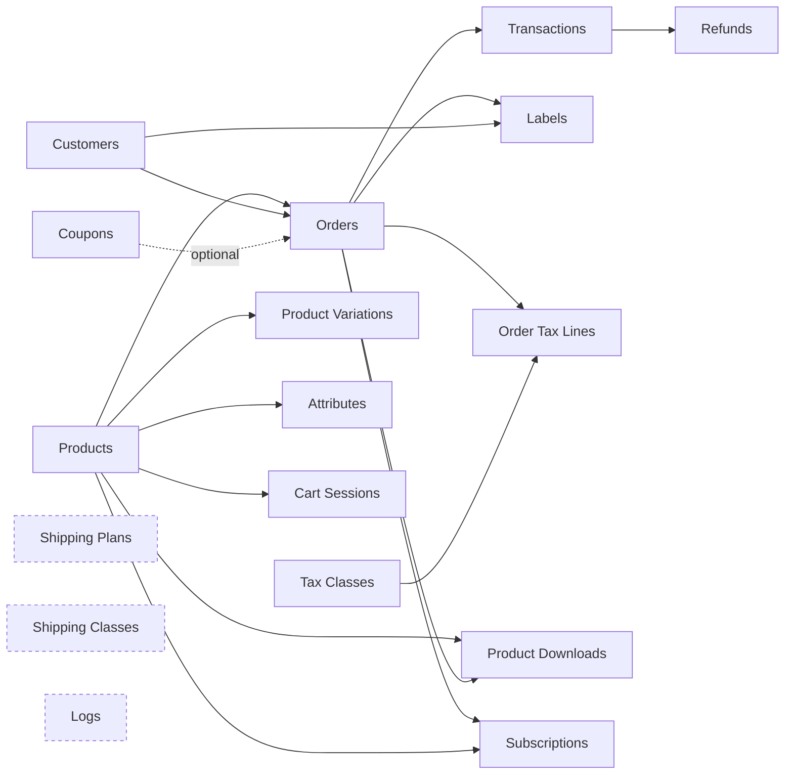

# Usage Guide

Running generators from the admin and from the REST API.

## Getting started

1. Open **StoreSeeder** in the WordPress admin menu
2. Pick a generator from the sidebar or the dashboard grid
3. Adjust the settings — the preview on the right updates as you type
4. Click **Generate _n_ items**

The first run on a site with more than one e-commerce platform active will ask which store to
write to before it proceeds. See [Choosing a target platform](#choosing-a-target-platform).

## The interface

One WordPress screen, hash-routed. There are no tabs.

| Region | What it is |
|---|---|
| **Sidebar** | Generators grouped into Core and Advanced, each with its run count. Settings and Our Plugins at the foot. Collapsible. |
| **Topbar** | Breadcrumb, the target-platform selector when more than one platform is active, the locale pill, theme toggle, and the batch chip once anything is queued |
| **Config column** | The generator's name, description, prerequisites, and its fields |
| **Live preview** | A read-only sample of the rows this run would create. Nothing is persisted. **Shuffle** re-rolls it. |
| **Run bar** | Count, seed, metadata toggle, **Add to batch**, and **Generate _n_ items** |

Press **⌘K** (or **Ctrl+K**) anywhere to jump to a generator or page.

## Choosing a target platform

StoreSeeder writes through a platform driver, so the store it writes to is a choice.

- **One platform active** — selected automatically; the selector does not appear, because there
  is no decision to make.
- **More than one active** — the topbar selector appears, defaulting to `Auto`. Because there is
  no safe default, the generator page shows a prompt and both run actions stay disabled until
  you choose. Writing to the wrong store is not something you would notice afterwards.

`Auto` names what it resolved to — `Auto · Fluent Cart` — so the target is never invisible. The
choice is stored **site-wide**, not per browser, so two administrators cannot unknowingly seed
different platforms.

A generator the target cannot represent is dimmed and, on its page, explains why — naming the
plugin that would enable it where one exists. Those cards remain clickable, because a card that
swallows clicks reads as broken.

## Running a generator

Common controls, on every generator:

| Control | Notes |
|---|---|
| **Count** | 1–100. The cap is per request; queue several runs for more. |
| **Seed** | Leave blank for random. A fixed seed makes the run reproducible. |
| **Metadata** | Whether to include extra metadata on generated records |

Then the generator's own fields, rendered from its parameter schema. See
[features.md](features.md#parameters) for the Core generators' fields in full.

### Order matters

Several generators build on others. Orders need products and customers; refunds need charge
transactions; order tax lines need orders and tax rates. A generator whose prerequisite is
missing says so and names what to generate first.

The real shape is a graph, not a list — an arrow means "needs this first":



Dashed nodes need nothing first. The simplest route is **down the sidebar, top to bottom**:
the list is ordered so that nothing appears before what it needs — Core first, then Advanced
grouped by what each generator attaches to (products, orders, tax, shipping, logs).

Working from the graph instead, a sensible order for a demo store is:

1. **Products**, **Customers** — everything else hangs off these
2. **Coupons**, **Tax Classes**, **Shipping Plans**, **Shipping Classes**, **Logs** — independent
3. **Orders**
4. **Transactions**
5. **Refunds**, **Labels**, **Order Tax Lines**, **Product Downloads**, **Subscriptions**

### The batch queue

**Add to batch** collects runs instead of executing one. Open the batch chip in the topbar to
review and run them.

The queue runs **in your browser**, one item at a time — leaving the page stops it. There is no
server-side background processing.

## Settings

**Settings** in the sidebar holds:

Grouped by who a change affects — **This site**, **Your preferences**, then **Plugin**. Every
card carries a scope badge, and the browser-stored ones save as you change them; there is no
Save button.

**This site**

- **Target platform** — where data is written, and what `Auto` currently resolves to. The same
  site-wide option the topbar selector writes
- **Who can generate data** — a switch per role. Administrators always can and are not listed;
  only an administrator can change the setting, so a role granted here cannot grant more roles
- **Sample data** — Sync now, Force re-sync, Revoke consent

**Your preferences**

- **Generation defaults** — default count, faker locale, seed, and metadata toggle
- **Appearance** — theme and density. Accent and per-token colours stay in **Tweaks**, which the
  card links to
- **Run history** — how many recent runs to keep per generator

**Plugin**

- **About** — version and links
- **Danger zone** — clear run history and statistics, or reset settings

> [!NOTE]
> Generation defaults, appearance and run history live in your **browser**, not the database, so
> they are per-person rather than per-site. The two things stored site-wide are the sample-data
> consent decision and the target platform — which is why changing the platform in Settings
> changes it for everyone.

## WP-CLI

```bash
wp storeseeder generate <resource> [--count=<n>] [--locale=<code>] [--seed=<n>] [--platform=<id>] [--<param>=<value>] [--porcelain]
wp storeseeder preview  <resource> [--count=<n>] [--locale=<code>] [--format=<table|json|csv|yaml>]
wp storeseeder platforms [--set=<id|auto>] [--format=<...>]
wp storeseeder locales [--search=<term>] [--format=<table|json|csv|yaml|ids>]
wp storeseeder sample-data [status|sync] [--force]
wp storeseeder cleanup [status|delete|forget] [--resource=<name>] [--limit=<n>] [--yes]
```

Each command dispatches through the REST controller for that resource, so validation,
platform resolution and the capability check are the same code the admin exercises. Anything
the endpoint accepts can be passed as a flag — a list as `--payment_methods=stripe,paypal`,
an object as `--price_range='{"min":5,"max":500}'`.

| Detail | Behaviour |
|---|---|
| `--user` | Required for everything that writes or reads store state. WP-CLI has no user by default, and StoreSeeder writes to a live store, so it verifies a capability rather than assuming shell access implies consent. `locales` is the exception — it only lists what the plugin can do. |
| Resource naming | Either spelling: `cart-sessions` or `cart_session`. A typo lists the valid ones. |
| Unknown flags | Rejected with the list of parameters that endpoint accepts, so `--lokale=de_DE` fails loudly instead of quietly generating English. |
| `--porcelain` | Prints only the number created, for scripting. |
| Sample data | `sync` acts on a consent decision already recorded; it cannot grant consent, because only the admin-page prompt can. |
| Cleanup | Deletes only rows StoreSeeder recorded creating, newest first, looping in batches until nothing is left. `forget` drops the records without touching the store, for a ledger that no longer matches reality. |

## REST API

All routes require the `manage_options` capability — or whatever `storeseeder_capability`
returns, or one of the roles allowed in Settings, all of which the admin menu and the MCP
abilities honour too — and a REST nonce. The one exception is `POST /access`, which always
requires `manage_options`: it decides who else gets in.

### Endpoints

```
POST /wp-json/storeseeder/v1/<rest-base>/generate
POST /wp-json/storeseeder/v1/<rest-base>/preview
```

The REST base is not always the resource name:

| Generator | REST base | Resource key in the response |
|---|---|---|
| Products | `products` | `product` |
| Customers | `customers` | `customer` |
| Orders | `orders` | `order` |
| Coupons | `coupons` | `coupon` |
| Product Variations | `product-variations` | `product_variation` |
| Shipping Plans | `shipping-plans` | `shipping_plan` |
| Tax Classes | `tax_classes` | `tax_class` |
| Transactions | `transactions` | `transaction` |
| Cart Sessions | `cart-sessions` | `cart_session` |
| Attributes | `attributes` | `attribute` |
| Brands | `brands` | `brand` |
| Product Categories | `product_categories` | `product_category` |
| Refunds | `refunds` | `refund` |
| Logs | `logs` | `log` |
| Shipping Classes | `shipping_classes` | `shipping_class` |
| Labels | `labels` | `label` |
| Order Tax Lines | `order_tax_rates` | `order_tax_rate` |
| Product Downloads | `product_downloads` | `product_download` |
| Subscriptions | `subscriptions` | `subscription` |

Platform and sample-data routes:

```
GET  /wp-json/storeseeder/v1/platforms
POST /wp-json/storeseeder/v1/platforms/target        { "platform": "fluent-cart" }
GET  /wp-json/storeseeder/v1/access                   # roles, capability, and whether you may change them
POST /wp-json/storeseeder/v1/access                   { "roles": ["editor"] }   # manage_options only
GET    /wp-json/storeseeder/v1/generated              # what StoreSeeder created, per resource
DELETE /wp-json/storeseeder/v1/generated              { "resource": "", "limit": 100 }   # a batch; the response says what is left
DELETE /wp-json/storeseeder/v1/generated              { "forget": true }   # drop the records, leave the rows
GET  /wp-json/storeseeder/v1/mcp                      # which AI tools are exposed, and whether you may change that
POST /wp-json/storeseeder/v1/mcp                      { "generate": false }     # manage_options only; any of enabled/preview/generate
GET  /wp-json/storeseeder/v1/download-sample
POST /wp-json/storeseeder/v1/download-sample         { "force": false }
POST /wp-json/storeseeder/v1/download-sample/consent { "granted": true }
```

### Universal parameters

| Parameter | Type | Notes |
|---|---|---|
| `count` | integer | **Required.** 1–100. |
| `locale` | string | One of 75 codes. `OPTIONS /wp-json/storeseeder/v1/products` returns the enum, and the Settings picker offers the same list — both come from `StoreSeeder\Platforms\Locale`. An unknown locale falls back to the same language if a variant exists, otherwise `en_US`. |
| `seed` | integer | Reproducible output |
| `platform` | string | Platform id, or `auto` (default) |
| `status` | string | Status filter for generated items |
| `date_range` | object | `{ "start": "YYYY-MM-DD", "end": "YYYY-MM-DD" }` |
| `relationships` | object | `create_missing`, `link_existing` |
| `meta_options` | object | Metadata generation options |

Generator-specific parameters are nested objects, not flattened. Products takes
`price_range: { min, max }` — there is no `price_min` / `price_max`.

### Example

```javascript
// The admin localises window.storeseederApi; wpApiSettings is not available here.
const { restUrl, restNonce } = window.storeseederApi;

const response = await fetch( `${ restUrl }products/generate`, {
  method: 'POST',
  headers: {
    'Content-Type': 'application/json',
    'X-WP-Nonce': restNonce,
  },
  body: JSON.stringify( {
    count: 10,
    locale: 'en_US',
    platform: 'auto',
    product_type: 'mixed',
    price_range: { min: 10, max: 500 },
  } ),
} );

const data = await response.json();
```

Or with `@wordpress/api-fetch`, which handles the nonce:

```javascript
import apiFetch from '@wordpress/api-fetch';

const data = await apiFetch( {
  path: '/storeseeder/v1/products/generate',
  method: 'POST',
  data: { count: 10, price_range: { min: 10, max: 500 } },
} );
```

### Response

Success is `200` with the generated items under the **resource key** — not a `data` wrapper, and
there is no `success` field:

```json
{
  "message": "10 items successfully created.",
  "product": [
    {
      "id": 123,
      "title": "Premium Widget",
      "price": 45.67,
      "status": "publish",
      "type": "simple",
      "created_at": "2026-07-31 10:15:00"
    }
  ]
}
```

Items may fail individually without aborting the batch. A partial batch adds two keys:

```json
{
  "message": "8 items successfully created. 2 could not be created.",
  "product": [ "…8 items…" ],
  "failed": 2,
  "errors": [ "No customers were found. Generate customers before generating orders." ]
}
```

If **nothing** succeeded, the response is `500` carrying the first reason, rather than `200` with
an empty list — a request that created no rows did not succeed.

### Errors worth recognising

| Status | Code | Meaning |
|---|---|---|
| `409` | `storeseeder_platform_required` | Several platforms active and none chosen. The payload lists the candidates. |
| `400` | `storeseeder_unknown_platform` | No driver claims that id |
| `400` | `storeseeder_platform_inactive` | Known driver, but its plugin is not active |
| `400` | `storeseeder_unsupported_resource` | The target cannot represent this resource. Carries the reason and, where one applies, the plugin slug that would enable it. |
| `500` | `storeseeder_missing_writer` | A driver claims the resource but ships no writer — a bug in that driver |
| `403` | `rest_forbidden` | Caller lacks the required capability (`manage_options` by default) |

### Preview

`/preview` takes the same parameters and returns table data without writing anything:

```json
{
  "columns": [ { "key": "name", "label": "Name" }, { "key": "price", "label": "Price" } ],
  "rows": [ { "name": { "v": "Premium Widget", "kind": "text" },
              "price": { "v": "$45.67", "kind": "money" } } ]
}
```

It needs no target platform, because previewing never reaches a writer.

## Best practices

- **Development and staging only.** Back up before generating large datasets.
- **Start small.** Run 5 items, check the result in your store's own admin, then scale up.
- **Generate in dependency order**, as above.
- **Use a fixed seed** when you need the same dataset twice — for a reproducible bug report, or
  a demo you want to rebuild.
- **Preview first.** It costs nothing and shows exactly what the run will produce.

## Troubleshooting

**No StoreSeeder menu**
No supported platform is active. The admin notice lists the ones you could install.

**"Choose where to write" will not clear**
Several platforms are active and none is chosen. Pick one in the topbar or on the generator
page.

**A generator is dimmed**
The chosen platform cannot represent it. Open it to read why; if a plugin would enable it, the
notice names it.

**Generation fails immediately**
Read the message — a missing prerequisite is stated explicitly, e.g. "Generate customers before
generating orders."

**Preview is empty**
Check the browser console for errors, and confirm the count is at least 1.

### Debug logging

```php
// wp-config.php
define( 'WP_DEBUG', true );
define( 'WP_DEBUG_LOG', true );
```

Entries appear in `wp-content/debug.log`, tagged with the resource type. There is no
plugin-specific debug constant.

## Support

- [GitHub Issues](https://github.com/mralaminahamed/storeseeder/issues)
- [`SUPPORT.md`](../SUPPORT.md) — where to ask and what to include
