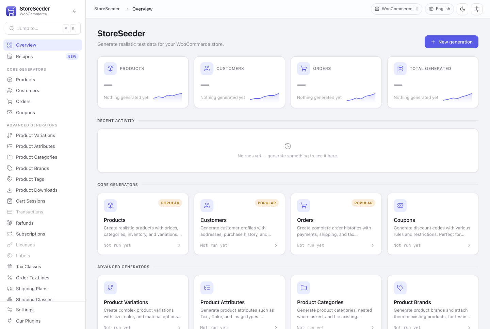

StoreSeeder generates realistic test data for WordPress e-commerce stores. Products with real prices and stock, customers with plausible addresses, orders that point at both.

Two ways in.

**A recipe** builds a whole coherent shop in one click — a corner grocer, a fashion boutique, a home & garden store — filled across nine resources in dependency order, sharing one vocabulary.

**A generator** builds one resource at a time, with a live preview and parameters that reach the output.

The sidebar lists both: Recipes above, then the twenty-one generators grouped into core and advanced.
Under the wordmark is the store everything will be written to.

## It is not single-platform

Which store the data lands in is a choice, not a build-time assumption. A **platform driver** owns that decision, and the same twenty-one generators feed every driver — so a fixed seed produces
identical data wherever it is written.

Fluent Cart and WooCommerce ship today. `storeseeder_platforms` is the whole surface needed to add another from a separate plugin.

A driver that cannot do something says so, and says *which kind* of cannot. WooCommerce records payment on the order, so there is no transaction record to create — a dead end. Subscriptions need a
plugin — a link. Those read differently to a user and the distinction is kept deliberately.

## Every record goes through the platform's own models

Not direct database writes. So generated data respects the same schema, relationships, validation and money handling as real data, and keeps working across that platform's updates.

The cost is that generation is slower than an `INSERT`. The benefit is that a store seeded this way behaves like a store.

## It can be removed again, exactly

Every row StoreSeeder writes is recorded in its own ledger. Deleting the test data walks that ledger and hands each id back to the writer that created it.

Nothing else is ever a candidate. Matching on "looks like test data" would eventually delete a real catalogue on a staging site restored from production, and that is not a mistake you can apologise
your way out of.

## What it is not for

:::caution
StoreSeeder writes large volumes of data directly into your store. Use it on development or staging sites, and back up your database before generating large datasets.
:::

It is a development tool. There is no scenario where seeding a live shop with two thousand fictional orders is the right move.

## Where to go next

- [Installation](/storeseeder/getting-started/installation/) — requirements and setup
- [Choosing a target](/storeseeder/getting-started/target-platform/) — where the data lands
- [Recipes](/storeseeder/guides/recipes/) — a whole shop in one click
- [Platform support](/storeseeder/reference/platform-support/) — the full matrix, with reasons
