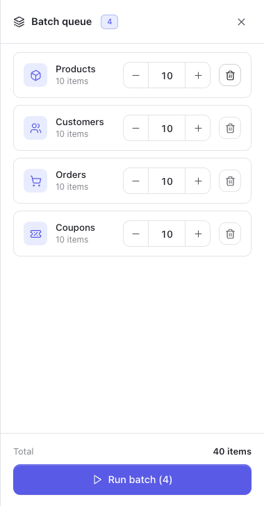

A [recipe](/storeseeder/guides/recipes/) fills a whole store from a fixed plan. A single
[generator](/storeseeder/guides/generators/) creates one resource. The batch queue is the middle case:
**your own plan, run in one go.**

Useful when you want two hundred products *then* nine hundred orders against them, with parameters you
chose rather than a recipe's, and you would rather not sit and watch the first finish.

## Queueing

On any generator page, configure it as you normally would and press **Add to batch** instead of
**Generate**. Nothing is written. The topbar's batch chip gains a count; click it to open the queue.



Each row keeps the parameters it was queued with, so two entries for the same resource with different
settings are two different jobs rather than one overwriting the other. Queue products at $5–$20 and
products at $200–$900 and you get both.

In the tray you can adjust each row's count with the stepper or remove it with the bin. The parameters
themselves are fixed once queued — to change those, remove the row and add it again from its own page.

## Order matters, and it is yours

The queue runs **top to bottom, in the order you added things**. It does not sort into dependency
order, and it does not warn you.

That is the trade against a recipe: a recipe knows brands come before products and products before
orders, because its plan is declared and validated. A batch is whatever you assembled, so getting the
order right is your job.

The practical rule is the same one the recipes follow:

```
brands, categories, tags  →  products  →  variations
customers                 →  orders    →  refunds, transactions
```

Queue orders before products on an empty store and they have nothing to point at.

## Running

**Run batch** works through the queue one row at a time, and the progress counts **rows completed, not
requests** — four queued generators is a bar that moves four times, however many rows each one creates.

Each row is split into requests of at most a hundred, the same way a single run is, because that is the
endpoint's own cap. A 900-order row is nine calls; the bar still moves once, when the row finishes.

A failure in one row does not abort the rest. The row is reported as failed and the queue carries on —
which is the behaviour you want when the fifth of six rows hits a platform limitation and the sixth is
unrelated.

Everything a batch writes goes through the ledger like anything else, so it is removable exactly from
[the danger zone](/storeseeder/guides/cleanup/).

## From the command line

There is no batch command, because the shell already has one:

```bash
wp storeseeder generate products --count=200 --price_range='{"min":5,"max":20}'
wp storeseeder generate customers --count=150
wp storeseeder generate orders --count=900
```

Sequential, ordered, and scriptable. The tray exists for the admin, where there is no `&&`.
