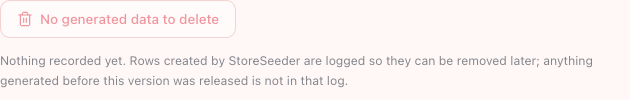
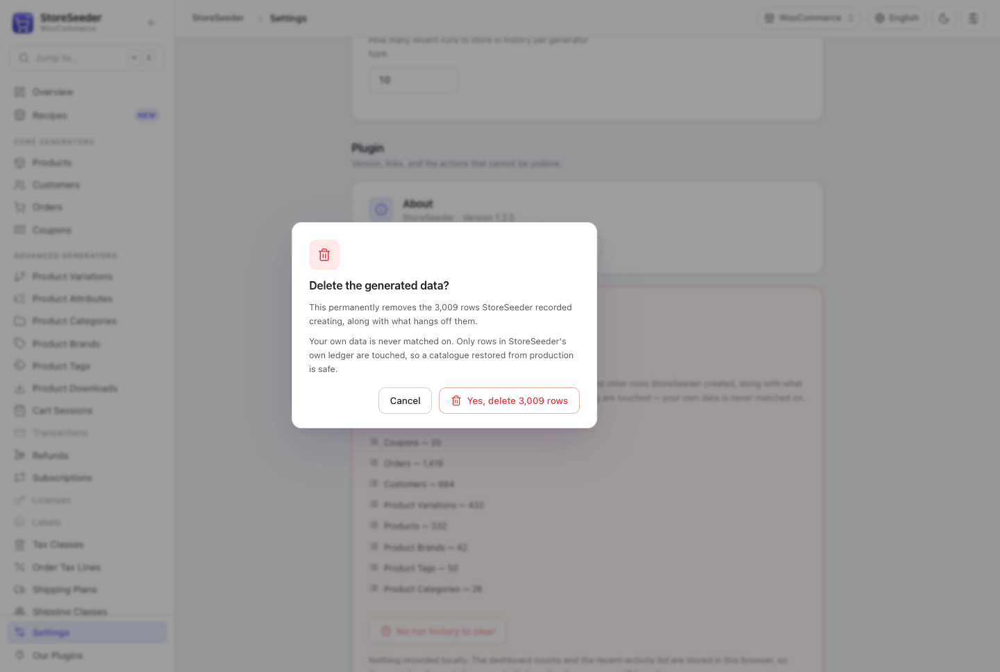
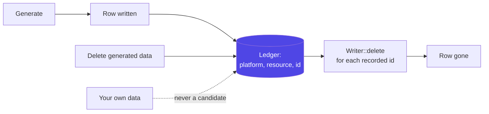

**Settings → Danger zone → Delete generated data.**



The count on the button is the ledger's, and the list beneath it is itemised per resource — so you can
see what a purge would take before you press it.



The confirmation names the number and states the bound. Cancel takes focus, Tab is trapped inside the
dialog, and Escape is refused while the deletion is running.



## Why it is safe to offer at all

Every row StoreSeeder writes is recorded in its own table: the platform it went to, the resource it was, and the id it got. Deletion walks that ledger and hands each id back to the writer that created
it.

Nothing else is ever a candidate. No date range, no "created by" match, no naming pattern.

That is not caution for its own sake. Matching on "looks like test data" would eventually delete a real catalogue on a staging site restored from production, and that is not a mistake you can
apologise your way out of. The ledger is what makes "remove the test data" an offer rather than a gamble.

## What that means in practice

- Rows generated **before** the ledger existed are not in it, and cannot be removed automatically. The Danger zone says so rather than reporting a count of zero as though there were nothing to do.
- A writer that cannot delete a resource **keeps** its ledger row. Forgetting it would leave the row in your store with nothing left that knows StoreSeeder put it there.
- Deletion is batched. A purge of 5,000 rows is many requests, and the progress is real.

## Undoing one recipe

A recipe run tags every row it writes with a run id, so the result panel's **Undo this recipe**
removes exactly that run — not everything StoreSeeder has ever created.

```bash
wp storeseeder cleanup --run_id=rcp_grocery_ab12cd
```

## Forget, which is not delete

**Forget the remaining records** drops StoreSeeder's *record* of rows without deleting them. They stay in your store.

It exists for a ledger that no longer matches reality — rows deleted by hand, say. But afterwards nothing knows StoreSeeder created them, so they can never be removed automatically again. It is the
least reversible action in the plugin and it asks first.

## Clearing the history

**Clear run history & stats** empties the dashboard counts, the sparklines and the activity list. Nothing leaves your store.

Those live in your browser's local storage, so another browser keeps its own. The button disables and says so when there is nothing to clear.

A purge already takes its own rows back off the counts, so the two do not need to be run together — the counts describe what exists, the history describes what happened, and only the first was made
wrong by a deletion.
