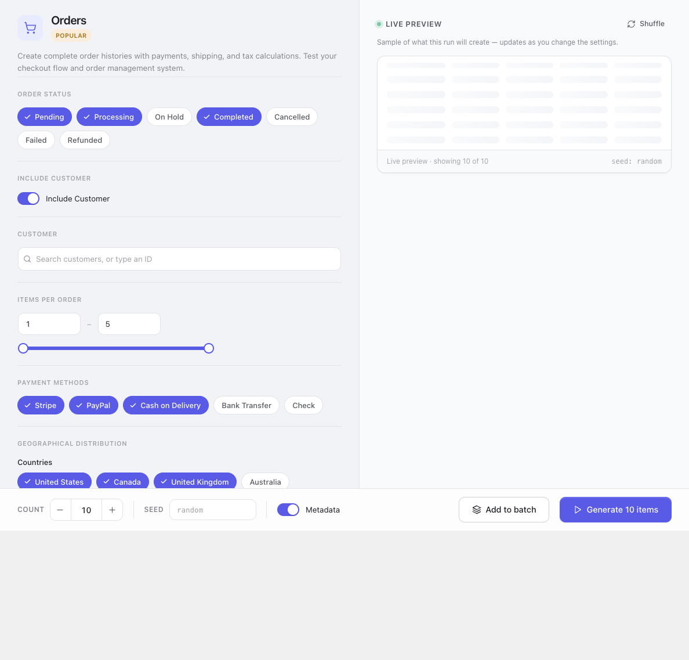
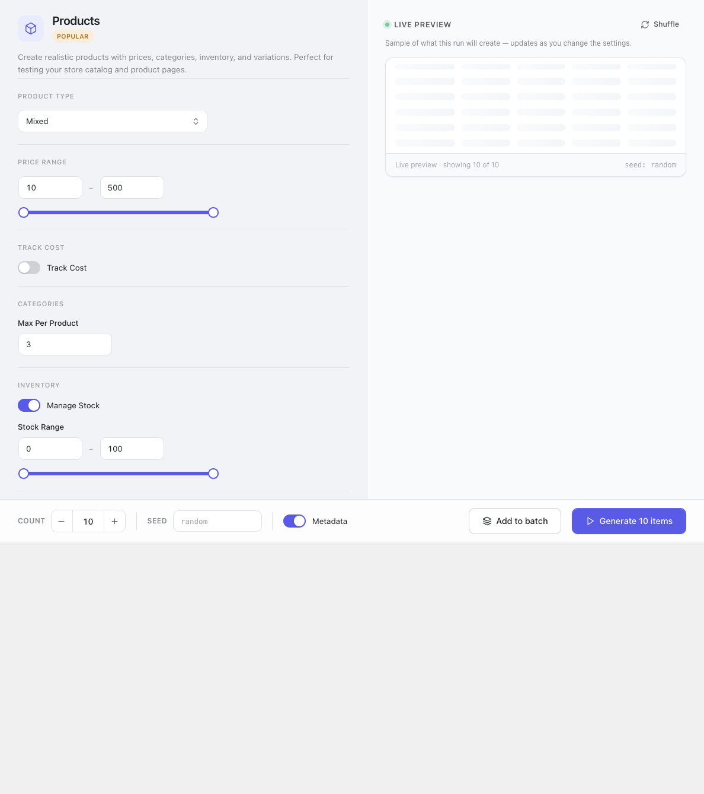

A generator creates one resource. There are twenty-one of them, and they all work the same way: set
the parameters on the left, read the preview on the right, press the button at the bottom.

Nothing is written until you press that button.

## The steps

### 1. Pick the generator

From the sidebar. They are grouped: **Core generators** are the four most stores need — products,
customers, orders, coupons — and **Advanced generators** is everything else, from product variations
to shipping classes and logs.

A generator your target platform cannot write is dimmed, with the reason on it. That is a statement
about the platform, not about the generator: see
[Platform support](/storeseeder/reference/platform-support/).

### 2. Check where it is going to write

If more than one store is active and you have not chosen, the page says so at the top of the parameter
column and offers the choice inline, rather than letting you configure a run that cannot start.

### 3. Set the parameters

The left column. What appears there depends on the resource, and every control is a real one — see
[a declared parameter changes the output](#a-declared-parameter-changes-the-output) below.

Common shapes:

| Control | Behaves like |
|---|---|
| **Range pair with a slider** | Both ends inclusive. Typing in either box moves the slider and vice versa. |
| **Chip group** | Multi-select. Every chip left on is in the pool the run draws from. |
| **Switch** | On/off, and switching it off usually removes whatever it governs from the output rather than zeroing it. |
| **Searchable picker** | A foreign key into your store. You search a name; the API receives an id. |

### 4. Read the preview

The right column is ten rows built exactly the way the run will build them. Change a parameter and it
rebuilds.

**Shuffle** re-rolls the sample without changing anything. Use it when one preview looks unlucky and
you want to know whether the shape is wrong or just that draw.

### 5. Set the count, and the seed if you want one

The bar along the bottom.

- **Count** — how many rows. One request handles up to a hundred; larger counts are chunked
  automatically and the progress is per chunk, so a big run does not look frozen.
- **Seed** — leave it `random` for different data every time, or type anything at all to get the same
  data every time. See [Seeds](#seeds).
- **Metadata** — writes StoreSeeder's own marker onto each row. Independent of the ledger, which
  records every row regardless; this is the one that makes a row identifiable when you are looking at
  it in the store's own admin.

### 6. Generate

Or **Add to batch**, if you would rather queue it — see [The batch queue](/storeseeder/guides/batch/).

Progress is reported as it goes and the result names what was created. If a chunk fails the rest still
run, and the failure is reported rather than swallowed.

Everything created here is recorded, and removable exactly, from
[the danger zone](/storeseeder/guides/cleanup/).

## The preview is the contract

Every column the preview shows comes from the same code path the run uses. Narrow a price range and
the preview narrows. Switch purchase history off and the customer's order count shows zero.

That sounds obvious and it was not always true. Several columns used to draw from their own literal
ranges, so you could narrow a parameter, watch the preview ignore it, and reasonably conclude the
parameter was decoration.

Four values in the preview are still invented, and only these four: the digits in a coupon code, an
order number, the digits in an SKU, and an order's total. The first three have no parameter behind
them. The total is invented because a real one is the sum of the catalogue prices of the products the
order points at — which is why an `order_value_range` parameter was *removed* rather than implemented.
An order line at $412 for a $19 product makes every revenue figure disagree with the store.

## A declared parameter changes the output

If a parameter appears in the admin, the REST schema, or an MCP tool's inputs, it reaches
`build_entity()` or a writer. Those three are three declarations of one contract and they are kept in
step.

When a parameter cannot be honoured it is removed rather than left to look functional. Two that were
removed for exactly that reason:

- `order_value_range` — see above.
- `customer_type` / `customer_distribution` — described a new-versus-existing split no writer
  implemented. `customer_id` replaced them, which is the part that was useful.

The reverse case has its own report. A platform that stores a resource but not all of its fields says
which fields, and the response lists them as `ignored` — so a request that could not be honoured in
full tells you which part was dropped instead of appearing to have worked.

## Pinning a customer or a product

`customer_id` and `product_id` are foreign keys into your store, and they used to be number boxes —
answerable only by somebody who already knew the id. They are searchable pickers now: you see a name,
the API receives an id.

The preview honours the pin. A run bound to one customer previews *that* customer rather than three
invented ones, which is the opposite of what it used to say.

## Seeds

Set a seed and the same run produces the same data. Not only on the same store — on **any** platform,
because a generator names no platform and a canonical entity carries no platform's own words.

That is what makes the guarantee hold across drivers rather than only within one. The same seed against
WooCommerce and against Fluent Cart produces the same catalogue, priced identically, differing only in
what each platform is able to store.

Two things are worth knowing:

- The seed governs the **data**, not the ids. Your store assigns those, so a re-run with the same seed
  makes matching products with different post ids.
- A count is part of the run, not part of the seed. The same seed at 10 and at 50 gives you the same
  first ten rows and forty more.

Useful for a bug report that needs the other person to see what you saw: give them the seed, the
locale and the count.

## Products and orders, specifically

Products are where most parameters live, because most of the catalogue's shape is decided there: the
price band, whether stock is tracked and over what range, how many categories each product is filed
under, description length, and cost tracking for margin reporting.

Orders are where the preview earns its keep. An order's total is the sum of the catalogue prices of the
products it points at, so the columns tell you whether the shape is right before you create nine
hundred of them — and the status and payment-method chips decide the mix, which is usually what a
report you are testing is actually sensitive to.

Order generation needs products and customers to exist first. It does not create them: it draws from
what is there. On an empty store, generate those two first, or run a
[recipe](/storeseeder/guides/recipes/), which does it in dependency order for you.
