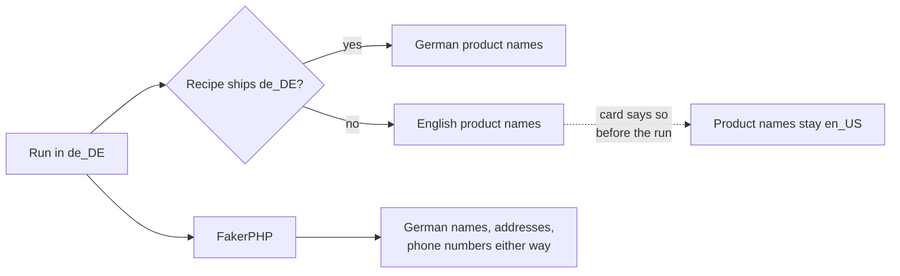

Pick a locale in the topbar or set a default in Settings. Names, addresses, phone numbers, postcodes and company names all follow it.

## One list, and why that matters

`Platforms\Locale` is the only locale list in the plugin. PHP reads it there; TypeScript reads the codes the server inlines.

A second list is how the admin came to offer **73 locales while the REST enum accepted 6**. Worse, FakerPHP's `Factory::create()` falls back to `en_US` in silence, so the other 67 produced English
with no error anywhere — a picker that appeared to work and did nothing.

Adding a locale means FakerPHP ships a provider for it. A test fails if the two disagree, which is what keeps the promise honest rather than aspirational.

## What changes with the locale

| | Follows the locale | Example, `de_DE` |
|---|---|---|
| Names | ✅ FakerPHP | *Katharina Brandt* |
| Street addresses | ✅ FakerPHP | *Lindenstraße 47* |
| Cities and states | ✅ FakerPHP | *München, Bayern* |
| Postcodes | ✅ FakerPHP | *80331* |
| Phone numbers | ✅ FakerPHP | *+49 89 1234567* |
| Company names | ✅ FakerPHP | *Brandt GmbH* |
| Product names | ⚠️ vocabulary, if shipped | falls back to English |
| Category names | ⚠️ vocabulary, if shipped | falls back to English |

## Vocabulary falls back, and says so

Locale affects two different things, and they degrade differently.

**FakerPHP data** — names, addresses, phone formats — is per-locale and always local.

**Vocabulary** — product nouns, category names, brand stems — is shipped per locale and may not exist for yours. When it does not, it falls back to `en_US`.



That fallback used to be silent, and it was the same bug in a different place: **72 of the 73 offered locales generated "Widget" and "Gadget"** from each generator's inline defaults, with a
`WP_DEBUG_LOG` line as the only sign.

Now the fallback is announced. A recipe that ships no vocabulary for your locale says so on its card, before the run rather than after it.

## Translating a recipe

Add a directory and a line — no plugin change, no release:

```
grocery/products/de_DE/product_names.json
grocery/product_categories/de_DE/departments.json
```

Then list `de_DE` in that recipe's `recipe.json` and regenerate the archive index. The card's warning disappears for German.
