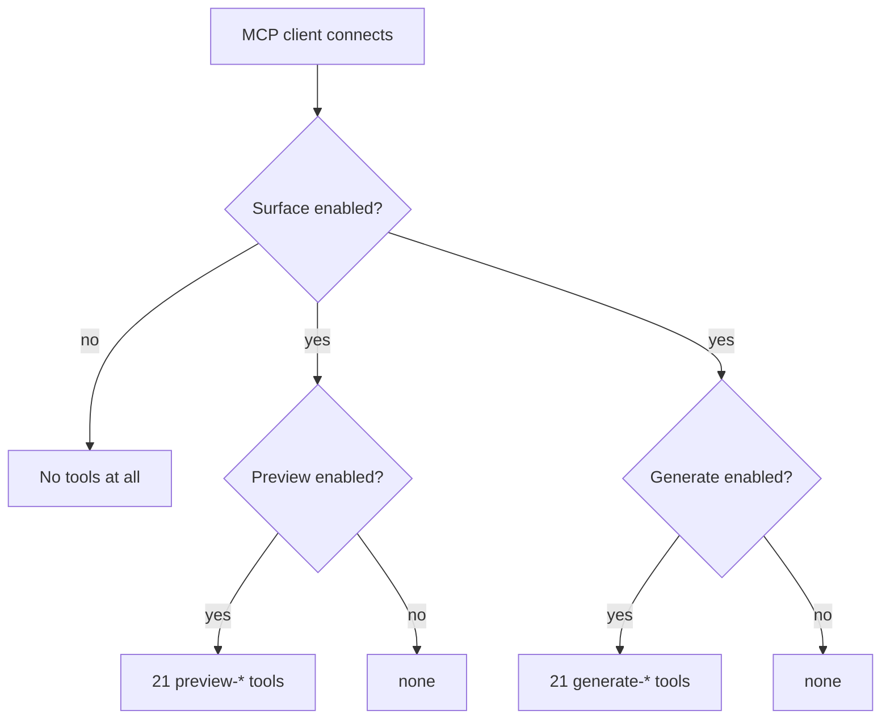

StoreSeeder exposes its generators over the **Model Context Protocol**, so an assistant can preview and create test data directly.

Twenty-one generators, two tools each:

|                       |                            |
|-----------------------|----------------------------|
| `preview-<resource>`  | Read-only. Touches nothing |
| `generate-<resource>` | Writes                     |

## Gated at registration, not at call time

**Settings → AI** has three switches: whether the surface exists at all, whether the read-only tools are registered, and whether the writing ones are.

Those are applied when tools are *registered*, so a withdrawn tool is **never registered** rather than registered-and-refusing.

That is the strongest form the promise can take. A tool that exists and declines can be probed, misreported, or re-enabled by a bug; a tool that was never offered cannot be called at all.

## The same gate as everything else

MCP is behind `StoreSeeder\Access` — the same capability that guards the admin menu, the REST routes and the AJAX handlers. Four surfaces, one gate, because a site that grants one and not the others
has a broken plugin rather than a subtly configured one.

## Both endpoints work

Tool definitions carry `meta.mcp.public`, which is what makes them work through mcp-adapter's own default server as well as StoreSeeder's endpoint. Dropping it silently breaks every client pointed at
`/wp-json/mcp/mcp-adapter-default-server`.

## A parameter declared to an AI is a parameter that works

An MCP ability's `input_properties()` is one of the three places a parameter can be declared — the others being the admin form and the REST schema. All three are declarations of one contract and they
are kept in step.

That is not tidiness. An assistant told a `price_range` exists will use it, report success, and hand back data that ignored it — and unlike a person, it has no way to notice.
