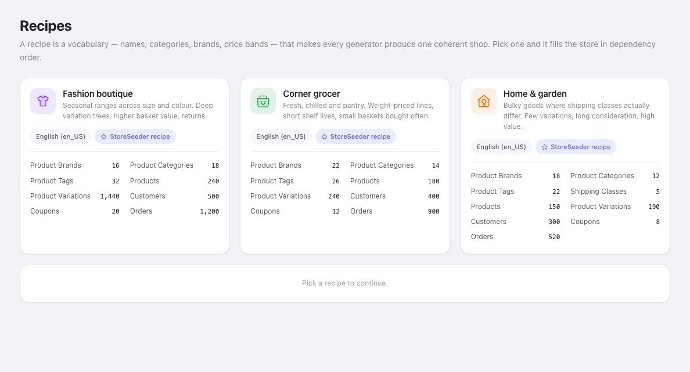
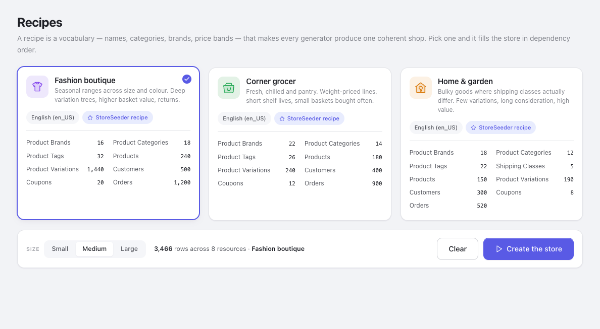
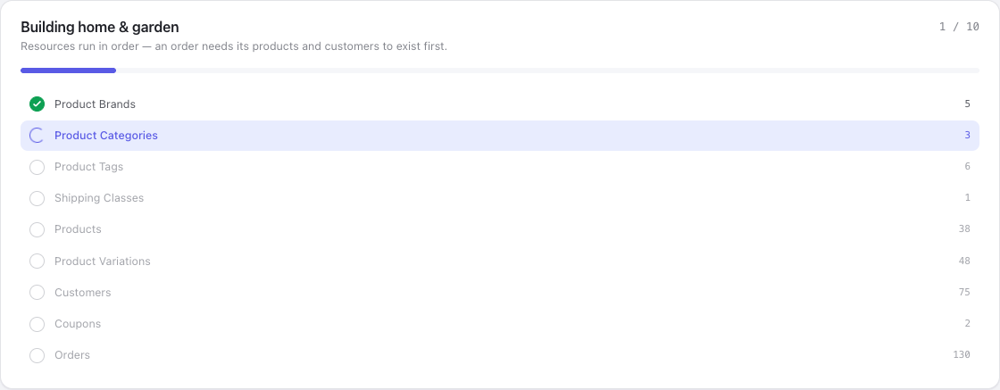
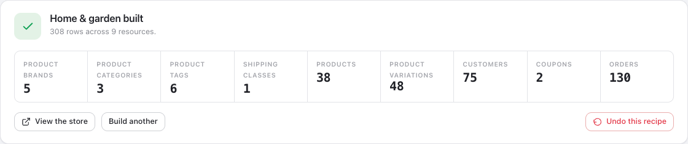

StoreSeeder can generate any volume you like. What it could not do, before recipes, was make two hundred products that look like **one business**.

Every store came out as the same generic catalogue, so somebody testing a fashion shop got *Premium Wireless Headphones · Size: XL*. No parameter closes that gap, because a parameter changes how many,
not what kind of shop.

## A vocabulary, not a dataset

A recipe supplies the words and the numeric bands that make a grocer look like a grocer — product names, a category tree, brand names, tag labels, a price band, variation axes — and then the existing
pipeline runs unchanged.

It is never a dump of records, and that distinction is the design rather than a detail. Records would bypass the generator layer, and the generator layer is where every guarantee lives:

- money as an integer in the currency's minor unit, never a float
- the canonical status vocabulary, mapped per platform
- no platform's own words inside a canonical entity
- a fixed seed reproducing the same store on every platform

A vocabulary pack re-implements none of it, and every parameter you already had keeps working on top of one.



## What ships

| Recipe        | Shop             | Rows at Medium | Reach for it when                                                   |
|---------------|------------------|----------------|---------------------------------------------------------------------|
| `grocery`     | Corner grocer    | 1,794          | You need cheap lines and high order counts. Weight-based variations |
| `fashion`     | Fashion boutique | 3,466          | You need a deep variation tree — 1,440 variations over 240 products |
| `home-garden` | Home & garden    | 1,225          | Shipping classes that genuinely differ. The widest price band       |

Each supplies all six things the completeness bar requires. A recipe that swapped the nouns and left the rest generic would be worse than none: grocery products priced $9.99–$999.99 in Size/Color is a
*plausible* lie, and a plausible lie is harder to notice than an obvious one.

## Start to finish

The whole flow, then the detail behind each part.

1. **Open Recipes** in the sidebar. On a fresh install you get a **Download the recipes** button
   instead of cards — see [The first run](#the-first-run).
2. **Choose a target store** if more than one is active. `Create the store` stays disabled until you
   do, and will not guess.
3. **Read the card.** The counts are itemised per resource, and anything your platform refuses is
   struck through with the reason beside it.
4. **Pick a card.** The run bar appears beneath the grid with the size, the row total, and any guard
   that applies.
5. **Pick a size** — Small (×0.25), Medium, or Large (×4). The counts on every card rescale live.
6. **Press Create the store.** It moves to its own screen and starts working through the plan in
   dependency order.
7. **Wait, or leave.** The progress is real and the run survives you navigating away.
8. **Read the result**, and use **Undo this recipe** if it was not what you wanted.

Each step is undoable, and the whole run is undoable as a unit, so there is no point in the flow where
you are committed to keeping it.

## The first run

Recipes are downloaded from [their own repository](https://github.com/mralaminahamed/storeseeder-recipes), so a fresh install shows a **Download the recipes** button rather than cards. It is about 90
KB, fetched once, and then everything works offline.

It reuses the consent decision the sample data already asked for — one record covers both, because asking twice for the same answer trains people to click through prompts.

:::note
Nothing is fetched on page load, on activation, or on a schedule. The only download is a button press.
:::

## Choosing

Counts are itemised per resource and rescale as you switch **Small** (×0.25), **Medium** or **Large**
(×4).

There is no preview table here, on purpose: a preview shows one resource and a recipe spans nine, so the counts *are* the preview.

Three things on a card are worth reading before you click.

**A struck-through count** is a resource your target refuses, with the driver's own reason beside it. On WooCommerce that is transactions — it records payment on the order, so there is no separate
record to create. The alternative would be promising 900 transactions and silently producing zero.

**"Product names stay en_US"** means the recipe ships no vocabulary for your chosen locale. Names and addresses will still be local, because FakerPHP handles those; the product titles come from
English. Said before the run rather than discovered after it.

**A red note** means the recipe would build a store that misrepresents itself — usually a download that did not finish. **Create the store** stays disabled until it is resolved.

If more than one store is active and none is chosen, the button is disabled and says so. StoreSeeder will not guess which store to write nine resources into.



Selecting a card reveals the run bar: the size, the total it comes to, and any guard that applies —
here, a warning that the store already holds generated rows and building on top of them leaves two
shops interleaved.

## While it runs



Resources run in **dependency order** — brands and categories before products, products and customers before orders — because an order needs something real to point at. Fan them out and you get orders
with no line items.

The plan is listed with a dot per step: filled and ticked when done, highlighted while running. A
resource your platform refuses stays in the list, struck through — dropping it silently would make the
step list disagree with the card you just read.

Each step shows the number of rows it will create, not a running `40 / 240`. The bar above is the
progress; the number is the size of the job.

The step counter is real. It counts completed requests, not an animation against a guessed duration, so a long step looks long instead of looking finished. You can leave the page and come back to a
build still going.

Requests are capped at 100 rows each, so a 900-order step is nine calls. That is deliberate twice over: one PHP request writing 5,000 rows times out, and chunking is what makes the progress honest.

## Afterwards



The result names what it made and links each count to that resource's admin screen, so you can go and look at the products you just created.

Anything that failed is listed rather than summarised away. A recipe reports partial success as partial
success: the steps that worked stay, and you can undo the run and try again once whatever blocked the
rest is fixed.

**Undo this recipe** removes exactly what that run wrote and nothing else — every row carries a run id in StoreSeeder's ledger. The same id works from the command line:

```bash
wp storeseeder cleanup --run_id=rcp_grocery_ab12cd
```

## From WP-CLI

```bash
wp storeseeder recipe list
wp storeseeder recipe run grocery
wp storeseeder recipe run fashion --size=small --platform=woocommerce
```

The command runs the same ordered plan through the same endpoints as the admin — one implementation rather than two that can disagree — and prints the run id to undo with.

## Writing your own

You do not need the shared archive at all. Register a manifest from your own plugin and say where the words live:

```php
add_filter( 'storeseeder_recipes', function ( $manifests ) {
    $manifests[] = json_decode( file_get_contents( __DIR__ . '/my-recipe/recipe.json' ), true );

    return $manifests;
} );

add_filter( 'storeseeder_recipe_directories', function ( $dirs ) {
    $dirs['my-recipe'] = __DIR__ . '/my-recipe';

    return $dirs;
} );
```

A manifest that will not parse is dropped with a debug line rather than thrown — a broken third-party recipe must not take the admin down with it. Recipes registered this way are marked **From a
plugin**
on the card, because they are not held to the shared archive's completeness bar and someone debugging odd product names should be able to see where they came from.

To replace the archive wholesale instead, filter `storeseeder_recipes_source`. Change **both** URLs it returns: `repo_url` is what the consent prompt shows an administrator, so changing only `zip_url`
would misrepresent what they agreed to.

## The manifest

```jsonc
{
  "id": "grocery",                  // also the directory name; [a-z0-9_] only
  "name": "Corner grocer",
  "description": "Fresh, chilled and pantry…",
  "icon": "cart",                   // fallback when icon.svg is absent
  "accent": "green",                // a theme token, never a hex value
  "locales": ["en_US"],

  // Ordered, and the order is the dependency order. An array rather than an
  // object because JSON objects have no guaranteed key order, and a shuffled
  // plan produces orders with no line items.
  "plan": [
    { "resource": "brand",   "count": 22  },
    { "resource": "product", "count": 180 },
    { "resource": "order",   "count": 900 }
  ],

  // Ordinary generation parameters, merged *under* whatever the caller sends —
  // so somebody who set their own price range still wins.
  "params": {
    "product": { "price_range": { "min": 0.79, "max": 42.5 } }
  }
}
```

:::caution[Check the keys]
`params` is not validated against the endpoint schema. All three shipped recipes once declared
`discount_range: {min, max}` when the coupon generator reads `min_percentage` and `max_fixed` — the recipes ran, reported success, and ignored the band entirely. Read the controller's
`get_resource_specific_params()` before writing a `params` block.
:::
