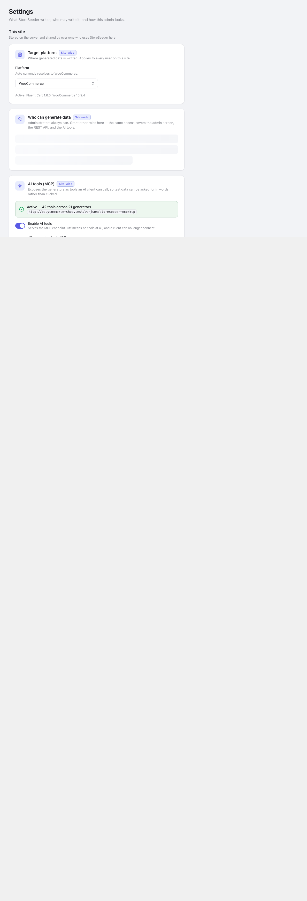

## This site

**Target platform** — where generated data goes. Stored site-wide, so it is not a per-user preference that two administrators could set differently.

**Default locale** — which of the 75 generatable locales new runs start from. One list feeds the admin picker, the REST enum and the MCP schema; a second list is how the admin came to offer 73 while
the API accepted 6, silently producing English for the other 67.

## Appearance

Theme, accent and density. Density is not cosmetic: it retunes control heights, type sizes and padding together through tokens, so compact mode shrinks a page rather than only its buttons.

## Sample data

The optional vocabulary archive — country lists, phone patterns, product nouns — downloaded from GitHub after an administrator accepts the consent prompt.

That prompt is the only thing that grants permission. Until it is accepted, **Sync now** reopens the prompt rather than downloading, so the question always sits on the action that needs it. **Revoke**
withdraws permission.

Declining costs nothing structural: every generator keeps working from built-in defaults.

## AI (Model Context Protocol)

Three switches: whether the surface exists at all, whether read-only `preview-*` tools are registered, and whether writing `generate-*` tools are.

The switches are applied **at registration**, so a withdrawn tool is never registered rather than registered-and-refusing. That is the strongest form the promise can take — a client cannot call
something that was never offered.

## Danger zone

Every action here asks first, and each confirmation states what it will *not* touch, because the bound is the reassuring part.

- **Delete generated data** — walks the ledger. Your own data is never matched on.
- **Forget the remaining records** — drops the record without deleting the rows. Least reversible thing in the plugin.
- **Clear run history & stats** — empties the dashboard. Nothing leaves your store.
- **Reset settings** — rewrites local preferences only.

See [Deleting generated data](/storeseeder/guides/cleanup/) for what each one means.
