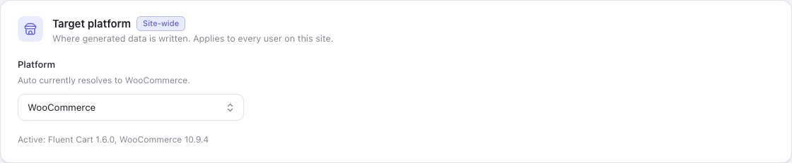
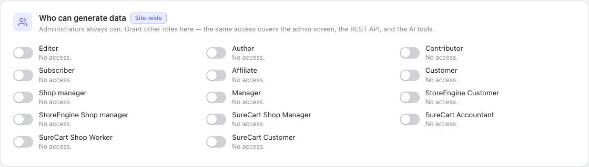
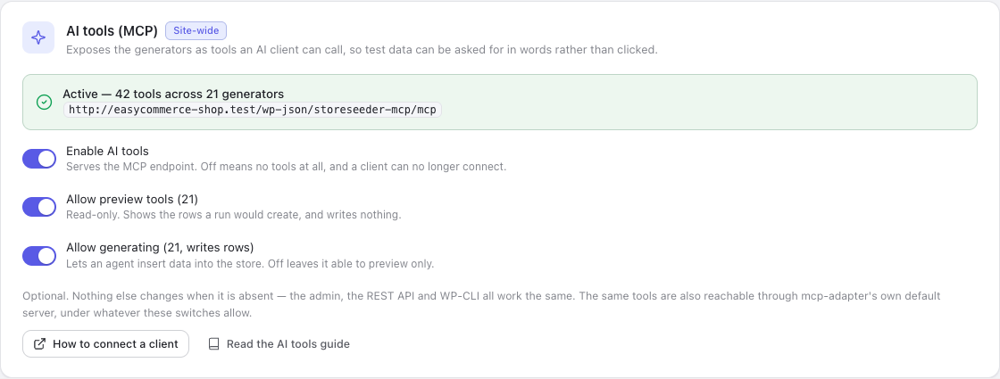
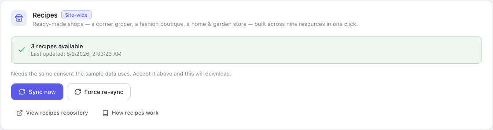
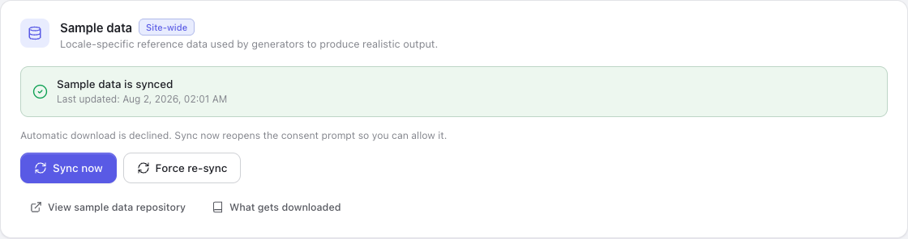

Settings is grouped by **who a change affects**, because that is the first thing worth knowing before
touching one on a site other people use. Every card says so on a badge: `Site-wide` is stored on the
server and shared by everyone, `This browser` is yours alone and follows nobody else.

## This site

### Target platform

Where generated data is written.

Stored site-wide, so it is not a per-user preference two administrators could set differently and then
disagree about. The same control sits in the topbar; they are one setting.

With one store active, `Auto` resolves to it and there is nothing to decide. With more than one, `Auto`
refuses to guess and every control that writes stays disabled until you choose — see
[Choosing a target](/storeseeder/getting-started/target-platform/) for why that is a refusal rather
than a default.

The line beneath names the versions it found, so a store you expected to see and cannot is a plugin
problem rather than a StoreSeeder one.

### Who can generate data

Administrators always can. Granting a role here covers **all four surfaces at once** — the admin
screen, the REST API, WP-CLI and the AI tools — because a site that grants the routes but not the page
has a broken plugin rather than a restricted one.

The list is every role the site defines, including those other plugins added, so what you see depends
on what is installed.

### AI tools (MCP)

Exposes the generators as tools an AI client can call. Three switches, and the order matters:

| Switch | Off means |
|---|---|
| **Enable AI tools** | No endpoint. A client cannot connect at all. |
| **Allow preview tools** | No `preview-*` tools. Nothing can read a sample. |
| **Allow generating** | No `generate-*` tools. Previews still work; nothing can write. |

They are applied **at registration**, so a withdrawn tool is never registered rather than registered
and refusing. A client cannot call something that was never offered, which is the strongest form the
promise can take.

The green line is the endpoint and the live tool count. Full detail in
[AI and MCP](/storeseeder/guides/mcp/).

### Recipes

How many ready-made shops are downloaded, and when they were last fetched. **Sync now** pulls the
archive; **Force re-sync** deletes the local copy first, which is what you want when a recipe has
*dropped* a file between versions — a plain download writes over what is there and leaves anything the
newer archive no longer ships.

Recipes live in [their own repository](https://github.com/mralaminahamed/storeseeder-recipes), so a new
shop type or a new locale for an existing one arrives without a plugin update. That is what the sync is
for, and the [Recipes page](/storeseeder/guides/recipes/) has a **Refresh** button that does the same
thing from where you would notice needing it.

If the archive downloaded only partly, the recipes the index promises but that are not on disk are
listed by name. A torn archive would otherwise present as a shorter list of recipes, and a shorter list
looks like a decision somebody made.

Consent is shared with the sample data below — one record covers both downloads, so revoking it stops
both.

### Sample data

The optional vocabulary archive — country lists, phone patterns, product nouns, street formats —
downloaded from GitHub.

**The consent prompt is the only thing that grants permission.** Until it is accepted, **Sync now**
reopens the prompt rather than downloading, so the question always sits on the action that needs it.
**Revoke** withdraws permission and stops future downloads.

**Force re-sync** deletes the local directories before fetching. It exists because a plain re-sync
once kept every stale file: `WP_Filesystem::move()` defaults to not overwriting, so an archive that
had changed was copied over an existing tree and silently lost the changes.

Declining costs nothing structural. Every generator keeps working from built-in defaults — you get
fewer distinct nouns, not an error. See
[External services](/storeseeder/reference/external-services/) for exactly what is requested.

## Your preferences

Stored in this browser. Nothing here changes what anyone else sees.

**Generation defaults** pre-fill the count, locale and seed on every generator page, so a preferred
working size is set once rather than typed each time.

**Appearance** is theme, accent and density. Density is not cosmetic: it retunes control heights, type
sizes and padding together through tokens, so compact mode shrinks a page rather than only its
buttons.

**Run history** caps how many recent runs per generator are kept for the dashboard's counts and
activity list.

## Plugin

**About** carries the version and the links. Below it, the danger zone.

Every action there asks first, and each confirmation states what it will *not* touch, because the
bound is the reassuring part:

- **Delete generated data** — walks the ledger. Your own data is never matched on.
- **Forget the remaining records** — drops the record without deleting the rows. The least reversible
  thing in the plugin.
- **Clear run history & stats** — empties the dashboard. Nothing leaves your store.
- **Reset settings** — rewrites local preferences only.

See [Deleting generated data](/storeseeder/guides/cleanup/) for what each one means and when to reach
for it.
