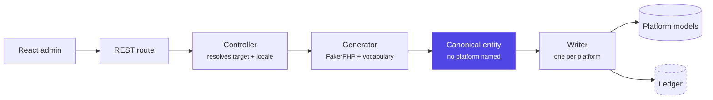
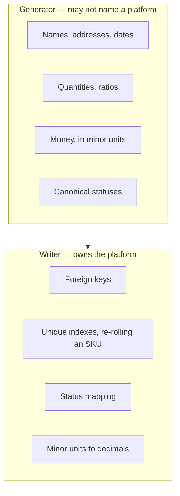

The highlighted step is the seam. A generator builds a **canonical entity** — platform-agnostic — and a writer translates it into one platform's models. That seam is what lets twenty-one generators
feed every driver.

## Four rules that are load-bearing

### A generator may not name a platform

No models, no table names, no platform-specific status strings, no database reads. `build_entity()` is FakerPHP and loaded vocabulary only.

This is what lets one generator feed every platform, and what lets a fixed seed produce the same data everywhere.

### Money is an integer in the currency's minor unit

Never a float. Binary rounding on a price is a real bug and an invisible one — $1,234.56 truncated to
`1234` shows in the admin as $12.34.

Fluent Cart stores cents, so its writers pass it through. WooCommerce wants decimals, so those writers divide.

### Statuses use the canonical vocabulary

Mapped per writer. The canonical names are deliberately no single platform's spelling: WooCommerce needs a `wc-` prefix, Fluent Cart does not, and picking either one as canonical would make the other
driver's writer the odd one out.

### Foreign keys and uniqueness belong to the writer

An order needs real product variations to have line items, and their real prices to have a total. A generator *proposes* an SKU; the platform that owns the unique index checks it and re-rolls.

So a writer legitimately reads before it writes. What it must never do is invent a name, address, date or quantity — those arrive on the entity, already localised.

## Where a decision is allowed to live



A writer legitimately *reads* before it writes — an order needs real variations to have line items. What it must never do is invent a name, address, date or quantity: those arrive on the entity,
already localised.

## The layers

```
includes/
  Access.php      one capability gate: menu, REST, MCP, AJAX
  Generation/     Generator.php (abstract) + Generators/*      21 generators
                  Ledger.php  Purge.php    what was created, and undoing it
  Recipes/        Recipe.php  Registry.php  what a whole shop is made of
  Rest/           Controller.php (abstract) + Controllers/*    21 controllers
  CLI/            Command.php (abstract) + Commands/*           7 commands
  MCP/            Ability.php (abstract) + Abilities/*         21 abilities, 42 tools
  Platforms/      Platform_Interface.php  Platform_Driver.php  Writer.php
                  Drivers/Fluent_Cart/    Drivers/Woo_Commerce/
```

Directories are named for the layer, not for what is inside them: each abstract sits at its layer's root, its concrete children in a plural directory beneath it.

## One value, computed once

The area that has broken most often is not a complicated one. It is **two computations of the same value that quietly stop matching**.

Four separate bugs of that shape, all found in one afternoon:

| Duplicate                                    | Symptom                                                                                                 |
|----------------------------------------------|---------------------------------------------------------------------------------------------------------|
| A second path resolver for recipe vocabulary | Every recipe produced generic data, and the audit reported no issues because it read the *correct* path |
| A second price range in the preview row      | Narrowing `price_range` appeared to do nothing                                                          |
| A second product-naming path                 | The preview showed Lorem for a run that produced real names                                             |
| A second status list                         | A canonical context carried WooCommerce's `on-hold`                                                     |

None crashed. Each produced plausible output that contradicted the thing it duplicated, which is why a test asserting the *agreement* — rather than any particular value — is the only kind that catches
them.

## Extension points

See [Extension points](/storeseeder/reference/extension-points/).
