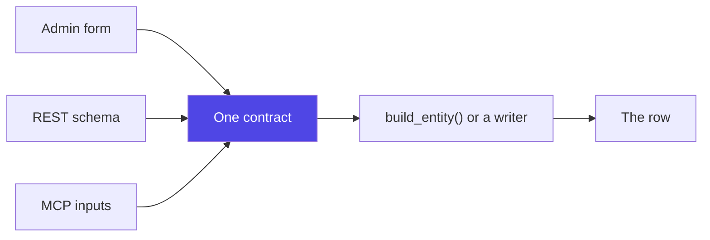

A parameter appears in up to three places: the admin form, the REST schema, and an MCP tool's inputs. Those are three declarations of **one** contract, and they are kept in step.

If a parameter is declared, it reaches `build_entity()` or a writer.

## Why this is a rule rather than an aspiration

It was not always true, and the failures were all silent.

The Products generator declared six parameter groups and read one. `price_range` was the worst: the admin offered a minimum and a maximum, and every product came out between $9.99 and $999.99 — a
control that moved, saved, and did nothing.



Nothing catches this on its own. A parameter that is accepted, validated, stored in a preset, and then ignored produces a successful run with plausible data. The only signal is somebody eventually
noticing the numbers do not match what they asked for.

## When a parameter cannot be honoured, it is removed

Not left in place looking functional. Two that went, for the shape of the mistake:

**`order_value_range`** asked for a total range. A total is the sum of the catalogue prices of the products the order points at — both drivers price line items from the real product, because an order
line at $412 for a $19 product makes every revenue figure disagree with the store. So the parameter could not be honoured without lying about the catalogue.

**`customer_type` / `customer_distribution`** described a new-versus-existing split no writer implemented. `customer_id` replaced them, which is the part that was useful.

## Platform-specific parameters

A property only one platform has — WooCommerce's `tax_status`, Fluent Cart's `payment_type` — arrives as a **generation parameter**, never an entity field.

That is not a technicality. A field only one platform stores would make a fixed seed produce different data on the others, which breaks the one guarantee the canonical entity exists to provide.

Routes register before any platform is resolved, so an endpoint accepts the **union** of every driver's fields and the response reports what the resolved target could not use:

```json
{ "ignored": ["payment_type"] }
```

That comparison is against what the request **sent**, never the merged parameters. Every declared argument with a default is present regardless, so the naive check reports every other platform's field
on every single run — and a warning that always fires is one nobody reads.

## The preview honours them

Every preview column a parameter governs comes from the same code path the run uses. Four values are still invented — a coupon code's digits, an order number, an SKU's digits, and an order total — and
only the last has a reason worth stating: a real total sums real product prices, which is the same reason `order_value_range` was removed.
